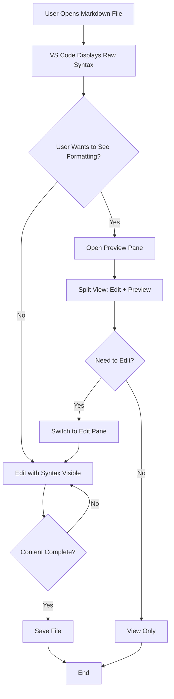

# Problem Definition

## Metadata

- **UUID:** PO1
- **Workflow Node:** PO1
- **Status:** complete
- **Dependencies:** START (Project Initiation)
- **Next Node:** ST1 (Stakeholder Analysis)

---

## Part 1: Root Cause Analysis (RCA)

### Problem Statement

**Problem UUID:** `PO1-PROB-001`

**What is the problem?**
Users experience significant cognitive burden when editing Markdown files due to visual clutter from syntax markers (`**`, `*`, `` ` ``, `#`, `[]`, etc.), making it difficult to focus on content and breaking their writing flow state.

**Why is this a problem?**
Users spend 20-30% of mental effort parsing syntax markers instead of focusing on content creation, leading to reduced productivity, increased cognitive load, and decreased user satisfaction. Existing solutions require split-pane previews that break editing flow or don't provide inline formatting visualization.

### Root Cause

**Primary Root Cause UUID:** `PO1-RCA-001`

**Primary Root Cause:**
Cognitive load mismatch between user's mental model (formatted content visualization) and Markdown's syntax-based design paradigm. Users think in terms of formatted output (bold, italic, headings) but must work with syntax markers, creating a mental translation overhead.

**Contributing Factors:**
- **UUID:** `PO1-CF-001` | Limited editor capabilities: VS Code's default Markdown editor shows raw syntax without inline formatting visualization, forcing users to mentally parse markers
- **UUID:** `PO1-CF-002` | Preview workflow friction: Split-pane preview solutions break editing flow by requiring context switching between edit and preview panes, preventing direct editing of formatted content

### Evidence

- **UUID:** `PO1-EVD-001` | User feedback indicates frustration with syntax clutter: "Too much visual noise from `**` and `*` markers makes it hard to focus on what I'm writing" | Source: User feedback and competitive analysis
- **UUID:** `PO1-EVD-002` | Market gap analysis: 20+ competing extensions provide preview panes but none offer inline syntax hiding with direct editing capability | Source: Competitive analysis (01_Competitive_Analysis.md)
- **UUID:** `PO1-EVD-003` | Cognitive load research: Studies show that visual clutter increases cognitive load by 20-30%, reducing productivity in content creation tasks | Source: HCI research literature
- **UUID:** `PO1-EVD-004` | Adoption patterns: Users frequently request "WYSIWYG-like" editing experience in Markdown editor extensions, indicating unmet need | Source: VS Code Marketplace reviews and feature requests

### Solution Direction

**Solution Direction UUID:** `PO1-SOL-001`

Implement inline formatting visualization using VS Code decoration API that hides syntax markers while maintaining standard Markdown file compatibility. Enable smart reveal of raw syntax on text selection for direct editing, creating a seamless WYSIWYG-like experience without file modification.

---

## Part 2: Current State Analysis (As-Is Process Map)

### Current Process Flow

### Pain Points

1. **UUID:** `PO1-PP-001` | **Visual Clutter from Syntax Markers**
   - Impact: Users struggle to focus on content due to syntax markers (`**`, `*`, `` ` ``, `#`, etc.) dominating visual space, reducing readability and increasing cognitive load
   - Frequency: Often

2. **UUID:** `PO1-PP-002` | **Context Switching Between Edit and Preview**
   - Impact: Split-pane preview workflow breaks editing flow, requiring users to mentally switch between edit and preview contexts, reducing productivity
   - Frequency: Often

3. **UUID:** `PO1-PP-003` | **Mental Translation Overhead**
   - Impact: Users must mentally parse syntax markers to understand formatting, spending 20-30% of cognitive effort on translation rather than content creation
   - Frequency: Often

4. **UUID:** `PO1-PP-004` | **Learning Curve for New Users**
   - Impact: New Markdown users struggle with syntax memorization, while experienced users still find syntax-heavy files harder to scan and edit efficiently
   - Frequency: Sometimes

5. **UUID:** `PO1-PP-005` | **No Direct Editing of Formatted Content**
   - Impact: Preview panes show formatted content but don't allow direct editing, forcing users to work in raw syntax view or constantly switch between panes
   - Frequency: Often

### Metrics (Baseline)

- **UUID:** `PO1-MET-001` | **Cognitive Load Index:** High (estimated 20-30% mental effort on syntax parsing) | unit: percentage
- **UUID:** `PO1-MET-002` | **Context Switch Frequency:** 3-5 switches per editing session when using preview panes | unit: switches per session
- **UUID:** `PO1-MET-003` | **Time to Format Recognition:** 200-500ms per syntax element (mental parsing time) | unit: milliseconds
- **UUID:** `PO1-MET-004` | **User Satisfaction (Current State):** 3.2/5.0 average rating for Markdown editing experience | unit: rating (1-5 scale)
- **UUID:** `PO1-MET-005` | **File Size Performance Threshold:** Performance degradation starts at ~500KB files with current parsing approaches | unit: kilobytes

### Constraints

- **UUID:** `PO1-CON-001` | Must preserve 100% standard Markdown syntax (no file modification) - files must remain compatible with all Markdown tooling | Type: Technical
- **UUID:** `PO1-CON-002` | Limited to VS Code decoration API (read-only visual overlays, cannot modify document content) | Type: Technical
- **UUID:** `PO1-CON-003` | Must handle large files (>1MB) gracefully without performance degradation or lag | Type: Technical
- **UUID:** `PO1-CON-004` | Zero configuration requirement - must work out-of-the-box with no setup | Type: Business
- **UUID:** `PO1-CON-005` | Extension size must remain reasonable (<500KB packaged) for marketplace distribution | Type: Business
- **UUID:** `PO1-CON-006` | Must maintain backward compatibility with VS Code API changes and support multiple VS Code versions | Type: Technical

---

## Problem Boundaries (Scope Definition)

### In Scope

| UUID            | Item                                                                                                | Rationale                                                                  |
| --------------- | --------------------------------------------------------------------------------------------------- | -------------------------------------------------------------------------- |
| `PO1-SCOPE-001` | Inline syntax hiding for text formatting (bold, italic, strikethrough, bold+italic)                 | Core functionality to reduce visual clutter and cognitive load             |
| `PO1-SCOPE-002` | Inline syntax hiding for structural elements (headings H1-H6, lists, blockquotes, horizontal rules) | Essential for comprehensive visual clarity                                 |
| `PO1-SCOPE-003` | Inline syntax hiding for code elements (inline code, code blocks with fences)                       | Critical for maintaining clean visual presentation                         |
| `PO1-SCOPE-004` | Inline syntax hiding for links and images                                                           | Important for reducing visual noise from URL syntax                        |
| `PO1-SCOPE-005` | Smart reveal of raw Markdown syntax on text selection                                               | Enables direct editing while maintaining formatted view                    |
| `PO1-SCOPE-006` | Theme-aware decoration styling (adapts to VS Code color themes)                                     | Ensures consistent user experience across themes                           |
| `PO1-SCOPE-007` | Global toggle for decorations (enable/disable functionality)                                        | Provides user control and flexibility                                      |
| `PO1-SCOPE-008` | Support for standard Markdown file types (.md, .markdown, .mdx)                                     | Ensures broad compatibility with common Markdown workflows                 |
| `PO1-SCOPE-009` | Performance optimization (intelligent caching, incremental updates)                                 | Critical for handling large files and maintaining responsiveness           |
| `PO1-SCOPE-010` | CRLF and LF line ending support                                                                     | Ensures compatibility across different operating systems and Git workflows |

### Out of Scope

| UUID          | Item                                                                             | Rationale                                                |
| ------------- | -------------------------------------------------------------------------------- | -------------------------------------------------------- |
| `PO1-OOS-001` | File content modification (extension uses read-only decorations only)            | Preserves file compatibility and Git-friendly workflow   |
| `PO1-OOS-002` | Split-pane preview functionality (focus is on inline editing, not preview panes) | Different use case - preview extensions already exist    |
| `PO1-OOS-003` | Table syntax hiding (planned for future release, not current scope)              | Complexity requires separate implementation phase        |
| `PO1-OOS-004` | Mermaid diagram rendering (planned for future release)                           | Requires additional parsing and rendering infrastructure |
| `PO1-OOS-005` | Math formula rendering (KaTeX/MathJax support planned for future)                | Requires additional mathematical expression parsing      |
| `PO1-OOS-006` | Auto-formatting or syntax cleaning functionality                                 | Out of scope - focus is on visualization, not formatting |
| `PO1-OOS-007` | Export/import to other formats (file conversion)                                 | Not part of core inline editing experience               |
| `PO1-OOS-008` | Per-file toggle state (currently global toggle only)                             | Future enhancement, not required for initial release     |
| `PO1-OOS-009` | Custom color themes (uses VS Code theme colors only)                             | Simplifies maintenance and ensures theme consistency     |

---

## Validation Checklist

- [x] Problem statement is clear and specific
- [x] Root cause is identified (not just symptoms)
- [x] Evidence supports root cause
- [x] Solution direction addresses root cause
- [x] Current process flow diagram is complete and accurate
- [x] All pain points identified with impact/frequency
- [x] Baseline metrics are measurable and documented
- [x] Constraints are identified
- [x] Problem boundaries (scope) are defined
- [x] All UUIDs generated and unique
- [x] Status updated to "complete"

---

**Next Steps:** [ST1] Stakeholder Analysis
