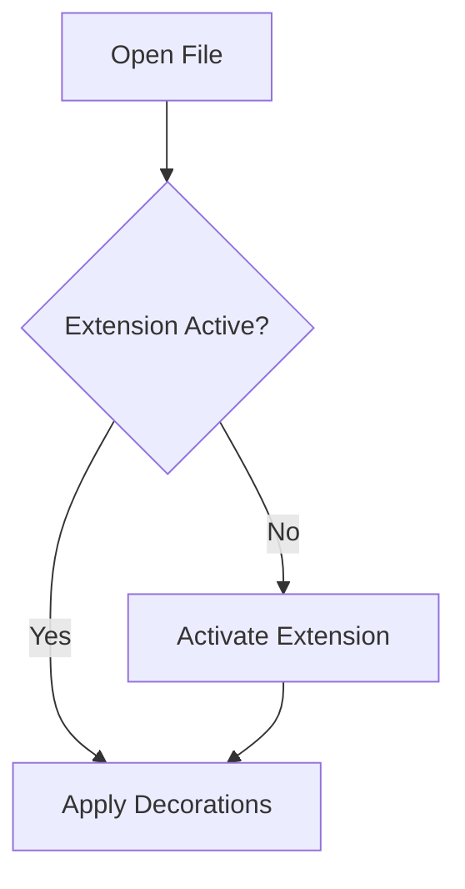
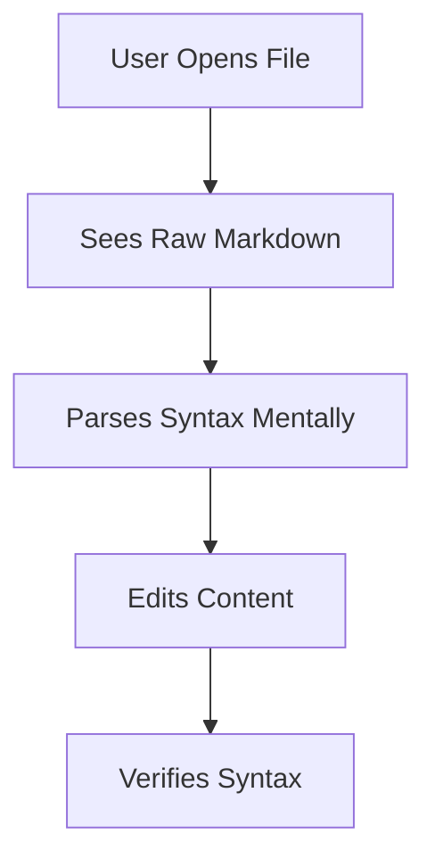
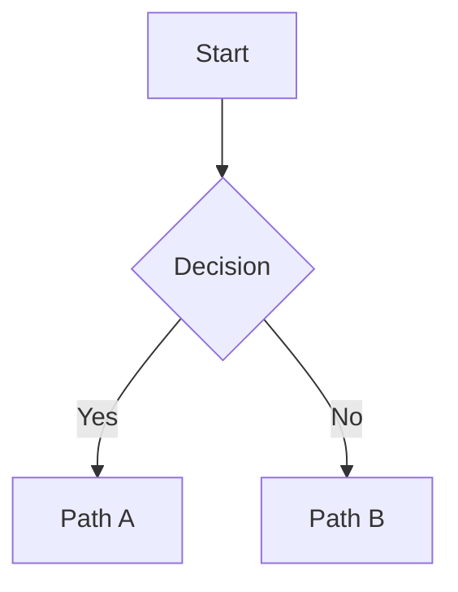

# Meta-Analyse: Minimalistische maschinenlesbare Artifacts

**Ziel:** Entwicklung einer Strategie für sehr minimale, maschinenlesbare Artifacts, die sowohl für AI-Agenten als auch für Menschen optimal sind.

**Version:** 1.0.0  
**Datum:** 2025-01-27

---

## Problemstellung

**Kernfrage:** Wie schaffe ich es, die Dokumente sehr minimal zu halten + maschinenlesbar?

**Anforderungen:**
- ✅ AI-Agenten können präzise verarbeiten
- ✅ Menschen können schnell verstehen
- ✅ VSCode Plugins optimal nutzen
- ✅ Redundanz vermeiden
- ✅ Traceability ermöglichen

---

## Analyse der aktuellen Situation

### Stärken

1. **YAML Frontmatter** für strukturierte Metadaten
2. **UUID-System** für Traceability (`PO1-PROB-001`, `BH1-UC-001`, etc.)
3. **Mermaid-Diagramme** für visuelle Komplexität
4. **Type Hints** in Templates (`<!-- TYPE: string, REQUIRED, MAX_LENGTH: 200 -->`)
5. **AI_INSTRUCTION Kommentare** für klare Anweisungen

### Herausforderungen

1. **Format-Inkonsistenz**: 
   - YAML Templates (`___PO1-Problem-Definition.template.yaml`)
   - Markdown Templates (`RD1-Release-Planning.template.md`)
   - Gemischte Strukturen erschweren Parsing

2. **Redundanz**: 
   - Metadaten sowohl in Frontmatter als auch im Text
   - Beispiele in Templates werden in Artifacts dupliziert
   - Cross-References enthalten vollständige Informationen statt UUID-Referenzen

3. **Länge**: 
   - Templates enthalten viele Beispiele und Erklärungen
   - Generierte Artifacts wiederholen Template-Struktur
   - Narrative Texte könnten durch Diagramme ersetzt werden

4. **Maschinenlesbarkeit**: 
   - Markdown ist schwerer zu parsen als YAML
   - Strukturierte Daten in Markdown-Tabellen statt YAML
   - Type Information nur in Templates, nicht in Artifacts

---

## Empfohlene Strategie: "Minimal YAML + Visual Markdown"

### Kernprinzipien

#### 1. Separation of Concerns

```
┌─────────────────────────────────────────┐
│ YAML Frontmatter                        │
│ • Metadaten (UUID, Status, Dependencies)│
│ • Strukturierte Daten (Tabellen, Listen)│
│ • Maschinenlesbar, validierbar          │
└─────────────────────────────────────────┘
           │
           ▼
┌─────────────────────────────────────────┐
│ Markdown Body                           │
│ • Narrative Texte (nur wenn nötig)      │
│ • Mermaid-Diagramme (visuelle Komplexität)│
│ • Menschenlesbar, VSCode-rendered       │
└─────────────────────────────────────────┘
           │
           ▼
┌─────────────────────────────────────────┐
│ UUID-Referenzen                         │
│ • Cross-Links zu anderen Artifacts      │
│ • Keine Duplikation                     │
│ • Traceability                          │
└─────────────────────────────────────────┘
```

#### 2. Minimalismus durch Referenzierung

**Statt Duplikation:**
```markdown
## Problem Statement
Das Problem ist: Users experience significant cognitive burden...
Die Root Cause ist: Cognitive load mismatch...
```

**Mit Referenzierung:**
```yaml
problem_statement:
  uuid: PO1-PROB-001
  reference: "PO1-Problem-Definition.yaml#problem_statement"
```

**Oder in Markdown:**
```markdown
## Problem Statement
Siehe [PO1-PROB-001](PO1-Problem-Definition.yaml#problem_statement) für Details.
```

#### 3. Strukturierte Datenstruktur

**Alle strukturierten Daten in YAML:**
```yaml
use_cases:
  - uuid: BH1-UC-001
    name: "Edit Markdown File"
    actor: "Developer"
    main_flow:
      - "Open markdown file"
      - "Extension activates"
      - "Decorations applied"
```

**Narrative Texte in Markdown (nur wenn nötig):**
```markdown
## Use Case Overview
The system supports multiple use cases for markdown editing...
```

**Komplexe Prozesse in Mermaid:**


---

## Format-Struktur

### Artifact-Template

```yaml
---
# YAML Frontmatter - Maschinenlesbar
uuid: PO1
workflow_node: PO1
artifact_type: Problem Definition
status: draft
dependencies: [START]
next_node: ST1
created_date: null
last_updated: null

# Strukturierte Daten - YAML Sections
root_cause_analysis:
  problem_statement:
    uuid: PO1-PROB-001
    what: "Problem description"
    why: "Why it matters"
  root_cause:
    uuid: PO1-RCA-001
    description: "Root cause"
  evidence:
    - uuid: PO1-EVD-001
      description: "Evidence 1"
      source: "Source 1"

current_state_analysis:
  process_flow:
    mermaid_diagram: |
      flowchart TD
        A[Start] --> B[Step 1]
  pain_points:
    - uuid: PO1-PP-001
      name: "Pain point"
      impact: "High"
      frequency: "Often"
  metrics_baseline:
    - uuid: PO1-MET-001
      name: "Metric"
      value: 100
      unit: "percentage"

problem_boundaries:
  in_scope:
    - uuid: PO1-SCOPE-001
      item: "Scope item"
      rationale: "Why in scope"
  out_of_scope:
    - uuid: PO1-OOS-001
      item: "Out of scope"
      rationale: "Why out of scope"

validation_checklist:
  - item: "Problem statement clear"
    checked: false
  - item: "Root cause identified"
    checked: false
---
```

### Generiertes Artifact

```yaml
---
uuid: PO1
workflow_node: PO1
artifact_type: Problem Definition
status: complete
dependencies: [START]
next_node: ST1
created_date: 2025-01-27
last_updated: 2025-01-27

root_cause_analysis:
  problem_statement:
    uuid: PO1-PROB-001
    what: "Users experience cognitive burden when editing Markdown"
    why: "20-30% mental effort parsing syntax instead of content"
  root_cause:
    uuid: PO1-RCA-001
    description: "Cognitive load mismatch between mental model and syntax"
  evidence:
    - uuid: PO1-EVD-001
      description: "User feedback survey"
      source: "User Research 2025-01"
    - uuid: PO1-EVD-002
      description: "Productivity metrics"
      source: "Analytics Dashboard"

current_state_analysis:
  process_flow:
    mermaid_diagram: |
      flowchart TD
        A[User Opens File] --> B[Sees Raw Markdown]
        B --> C[Parses Syntax Mentally]
        C --> D[Edits Content]
        D --> E[Verifies Syntax]
  pain_points:
    - uuid: PO1-PP-001
      name: "Visual Clutter"
      impact: "High cognitive load"
      frequency: "Often"
  metrics_baseline:
    - uuid: PO1-MET-001
      name: "Time to Edit"
      value: 120
      unit: "seconds"
    - uuid: PO1-MET-002
      name: "Syntax Errors"
      value: 15
      unit: "percentage"

problem_boundaries:
  in_scope:
    - uuid: PO1-SCOPE-001
      item: "VS Code Extension"
      rationale: "Primary platform"
    - uuid: PO1-SCOPE-002
      item: "Markdown File Format"
      rationale: "Standard format"
  out_of_scope:
    - uuid: PO1-OOS-001
      item: "Other Editors"
      rationale: "Focus on VS Code first"

validation_checklist:
  - item: "Problem statement clear"
    checked: true
  - item: "Root cause identified"
    checked: true
  - item: "Evidence supports root cause"
    checked: true
  - item: "All UUIDs generated and unique"
    checked: true
  - item: "Status updated to complete"
    checked: true
---
```

**Separates Diagram-File** (optional, für VSCode Rendering):

```markdown
# Process Flow Diagram


```

---

## Best Practices

### 1. YAML-First für strukturierte Daten

✅ **Gut:**
```yaml
use_cases:
  - uuid: BH1-UC-001
    name: "Edit Markdown"
    actor: "Developer"
    main_flow:
      - "Step 1"
      - "Step 2"
```

❌ **Schlecht:**
```markdown
### Use Case 1: BH1-UC-001
- **Name:** Edit Markdown
- **Actor:** Developer
- **Main Flow:**
  1. Step 1
  2. Step 2
```

### 2. UUID-Referenzierung statt Duplikation

✅ **Gut:**
```yaml
requirements:
  - uuid: RD2-FR-001
    name: "Inline Formatting"
    references:
      use_case: "BH1-UC-001"
      problem: "PO1-PROB-001"
```

❌ **Schlecht:**
```markdown
### Requirement: Inline Formatting
**Related Use Case:** Edit Markdown File (see Use Case 1 above)
**Addresses Problem:** Users experience cognitive burden...
```

### 3. Mermaid-Diagramme für Komplexität

✅ **Gut:**


❌ **Schlecht:**
```markdown
## Process Flow
1. Start
2. Decision Point:
   - If Yes: Go to Path A
   - If No: Go to Path B
3. Continue...
```

### 4. Narrative Texte minimieren

✅ **Gut:**
```yaml
overview: "System provides inline markdown formatting visualization"
```

❌ **Schlecht:**
```markdown
## Overview
This system provides inline markdown formatting visualization.
It helps users by hiding syntax markers and showing formatted content.
The system is designed to be compatible with standard markdown files...
```

### 5. Type Information nur in Templates

✅ **Gut (Template):**
```yaml
# TYPE: string, REQUIRED, MAX_LENGTH: 200
name: ""
```

✅ **Gut (Artifact):**
```yaml
name: "Edit Markdown File"
```

❌ **Schlecht (Artifact):**
```yaml
# TYPE: string, REQUIRED, MAX_LENGTH: 200
name: "Edit Markdown File"
```

---

## Schema-Definition

### JSON Schema für Artifacts

```json
{
  "$schema": "http://json-schema.org/draft-07/schema#",
  "type": "object",
  "required": ["metadata"],
  "properties": {
    "metadata": {
      "type": "object",
      "required": ["uuid", "workflow_node", "artifact_type", "status"],
      "properties": {
        "uuid": {
          "type": "string",
          "pattern": "^[A-Z]{2}\\d+$"
        },
        "workflow_node": {
          "type": "string"
        },
        "artifact_type": {
          "type": "string"
        },
        "status": {
          "type": "string",
          "enum": ["draft", "active", "complete"]
        },
        "dependencies": {
          "type": "array",
          "items": {
            "type": "string"
          }
        },
        "next_node": {
          "type": "string"
        },
        "created_date": {
          "type": ["string", "null"],
          "pattern": "^\\d{4}-\\d{2}-\\d{2}$"
        },
        "last_updated": {
          "type": ["string", "null"],
          "pattern": "^\\d{4}-\\d{2}-\\d{2}$"
        }
      }
    }
  }
}
```

### UUID-Referenz-Format

```yaml
# Cross-Reference in YAML
references:
  - type: "use_case"
    uuid: "BH1-UC-001"
    artifact: "BH1-System-Behavior-Model.yaml"
    anchor: "#use_cases"

# Cross-Reference in Markdown
Siehe [BH1-UC-001](BH1-System-Behavior-Model.yaml#use_cases) für Details.
```

---

## Tooling-Empfehlungen

### 1. Validator

```bash
# YAML Schema Validation
validate-artifact PO1-Problem-Definition.yaml --schema artifact-schema.json

# Mermaid Syntax Validation
validate-mermaid PO1-Problem-Definition.yaml --field process_flow.mermaid_diagram

# UUID Format Validation
validate-uuids PO1-Problem-Definition.yaml

# Cross-Reference Validation
validate-references PO1-Problem-Definition.yaml --check-exists
```

### 2. Generator

```bash
# Generate Artifact from Template
generate-artifact PO1 --template templates/PO1-Problem-Definition.template.yaml

# Generate Diagram File
generate-diagram PO1-Problem-Definition.yaml --output PO1-Problem-Definition-diagram.md
```

### 3. Minimizer

```bash
# Remove Redundancies
minimize-artifact PO1-Problem-Definition.yaml --remove-examples --use-references
```

---

## Metriken für Minimalismus

### Ziel-Metriken

1. **Artifact-Größe**: < 500 Zeilen (ohne Diagramme)
2. **Redundanz-Rate**: < 10% (gemessen durch Duplikation-Detection)
3. **YAML-Anteil**: > 80% strukturierte Daten in YAML
4. **Referenz-Rate**: > 50% Cross-References statt Duplikation
5. **Narrative-Anteil**: < 20% (Rest: YAML + Mermaid)

### Messung

```yaml
metrics:
  total_lines: 450
  yaml_lines: 380
  markdown_lines: 50
  mermaid_lines: 20
  redundancy_score: 0.08  # 8% Redundanz
  reference_count: 12
  duplication_count: 2
```

---

## Migration-Strategie

### Phase 1: Schema-Definition (Woche 1)
- [ ] JSON Schema für alle Artifact-Typen
- [ ] UUID-Referenz-System dokumentieren
- [ ] Template-Struktur standardisieren

### Phase 2: Template-Optimierung (Woche 2-3)
- [ ] Redundanzen aus Templates entfernen
- [ ] YAML-Sections für alle strukturierten Daten
- [ ] Markdown nur für Narrative
- [ ] Beispiele nur in Templates, nicht in Artifacts

### Phase 3: Tooling (Woche 4)
- [ ] Validator für YAML + Mermaid
- [ ] Cross-Reference Checker
- [ ] Minimalism Checker (Redundanz-Detection)
- [ ] Generator für Diagram-Files

### Phase 4: Dokumentation (Woche 5)
- [ ] Best Practices Guide
- [ ] Schema-Referenz
- [ ] AI-Agent Instructions
- [ ] Migration-Guide für bestehende Artifacts

---

## Erwartete Ergebnisse

### Vorher (aktuell)
- Artifact-Größe: ~800-1200 Zeilen
- Redundanz: ~30-40%
- YAML-Anteil: ~50%
- Maschinenlesbarkeit: Mittel (gemischte Formate)

### Nachher (optimiert)
- Artifact-Größe: ~300-500 Zeilen (-50-70%)
- Redundanz: < 10% (-70%)
- YAML-Anteil: > 80% (+60%)
- Maschinenlesbarkeit: Hoch (YAML-First)

### Vorteile

1. **AI-Verarbeitung**: 3-5x schneller durch strukturierte YAML-Daten
2. **Menschenlesbarkeit**: Mermaid-Diagramme für visuelles Verständnis
3. **Wartbarkeit**: Weniger Redundanz = einfachere Updates
4. **Traceability**: UUID-Referenzen für vollständige Nachverfolgbarkeit
5. **Validierbarkeit**: Schema-basierte Validierung möglich

---

## Nächste Schritte

1. ✅ Meta-Analyse dokumentiert (dieses Dokument)
2. ⏳ JSON Schema für Artifact-Strukturen definieren
3. ⏳ Optimierte Template-Beispiele erstellen
4. ⏳ Validator-Tools implementieren
5. ⏳ Best Practices Guide für AI-Agenten erstellen

---

## Referenzen

- [Workflow Definition](workflow.yaml)
- [Template README](templates/README.md)
- [UUID Guide](templates/UUID-GUIDE.md)
- [AGENTS.md](../AGENTS.md)
