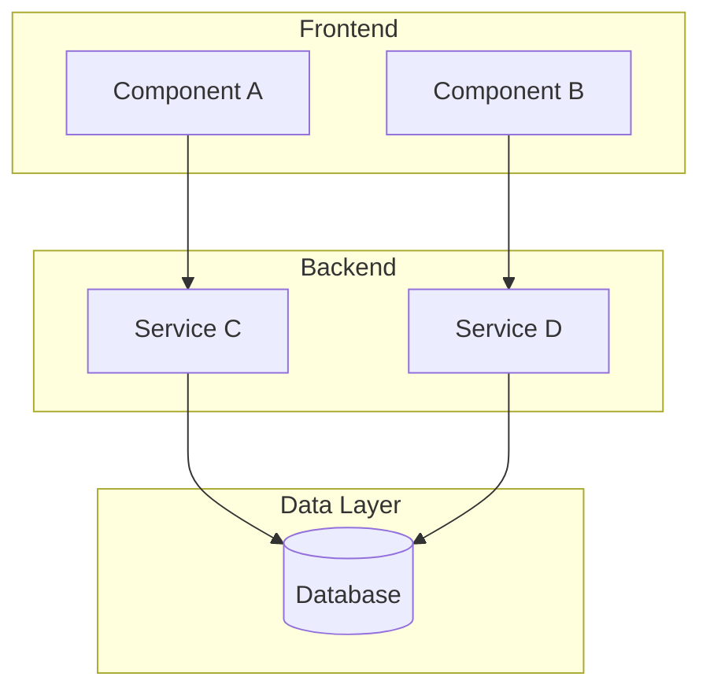

# Architecture Model

## Metadata

- **UUID:** AR1
- **Workflow Node:** AR1
- **Status:** draft | active | complete
- **Dependencies:** BH1 (System Behavior Model), DM1 (Data Model)
- **Next Node:** SC1 (Security Model)

---

## System Architecture Document

<!-- AI_INSTRUCTION: Document system architecture including high-level overview, architectural patterns, component descriptions, and design decisions. Generate UUID for each architectural component and decision. -->

### Architecture Overview

<!-- TYPE: string, REQUIRED, MAX_LENGTH: 1000 -->

### Architectural Patterns

<!-- TYPE: array[object], REQUIRED, MIN_ITEMS: 2, MAX_ITEMS: 10 -->
<!-- SCHEMA: {uuid: string, pattern_name: string, description: string, rationale: string, trade_offs: string} -->

| UUID | Pattern Name | Description | Rationale | Trade-offs |
|------|--------------|-------------|-----------|------------|
| `AR1-PAT-001` | <!-- TYPE: string, REQUIRED, MAX_LENGTH: 100 --> | <!-- TYPE: string, REQUIRED, MAX_LENGTH: 300 --> | <!-- TYPE: string, REQUIRED, MAX_LENGTH: 300 --> | <!-- TYPE: string, REQUIRED, MAX_LENGTH: 300 --> |

### System Components

<!-- TYPE: array[object], REQUIRED, MIN_ITEMS: 3, MAX_ITEMS: 20 -->
<!-- SCHEMA: {uuid: string, component_name: string, description: string, responsibilities: array[string], interfaces: array[string], dependencies: array[string]} -->

| UUID | Component Name | Description | Responsibilities | Interfaces | Dependencies |
|------|----------------|-------------|------------------|------------|---------------|
| `AR1-COMP-001` | <!-- TYPE: string, REQUIRED, MAX_LENGTH: 50 --> | <!-- TYPE: string, REQUIRED, MAX_LENGTH: 300 --> | <!-- TYPE: array[string], REQUIRED, MIN_ITEMS: 1, MAX_ITEMS: 5 --> | <!-- TYPE: array[string], REQUIRED, MIN_ITEMS: 1, MAX_ITEMS: 5 --> | <!-- TYPE: array[string], OPTIONAL, MAX_ITEMS: 5 --> |

### Design Decisions

<!-- TYPE: array[object], REQUIRED, MIN_ITEMS: 3, MAX_ITEMS: 15 -->
<!-- SCHEMA: {uuid: string, decision: string, context: string, alternatives: array[string], rationale: string, consequences: string} -->

| UUID | Decision | Context | Alternatives | Rationale | Consequences |
|------|----------|---------|-------------|-----------|--------------|
| `AR1-DEC-001` | <!-- TYPE: string, REQUIRED, MAX_LENGTH: 200 --> | <!-- TYPE: string, REQUIRED, MAX_LENGTH: 300 --> | <!-- TYPE: array[string], REQUIRED, MIN_ITEMS: 1, MAX_ITEMS: 5 --> | <!-- TYPE: string, REQUIRED, MAX_LENGTH: 500 --> | <!-- TYPE: string, REQUIRED, MAX_LENGTH: 300 --> |

---

## System Architecture Diagram

<!-- AI_INSTRUCTION: Create system architecture diagram using Mermaid. Show components, relationships, and data flow. -->



<!-- TYPE: mermaid_diagram, REQUIRED, VALIDATION: must be valid Mermaid syntax -->

---

## Technology Stack Matrix

<!-- AI_INSTRUCTION: Define technology stack with categories, technologies, versions, and rationale. Generate UUID for each technology selection. -->

<!-- TYPE: array[object], REQUIRED, MIN_ITEMS: 5, MAX_ITEMS: 30 -->
<!-- SCHEMA: {uuid: string, category: string, technology: string, version: string, purpose: string, rationale: string, alternatives_considered: string} -->

| UUID | Category | Technology | Version | Purpose | Rationale | Alternatives Considered |
|------|----------|------------|---------|---------|-----------|------------------------|
| `AR1-TECH-001` | <!-- TYPE: string, REQUIRED, MAX_LENGTH: 50, EXAMPLE: Frontend|Backend|Database|DevOps|Testing --> | <!-- TYPE: string, REQUIRED, MAX_LENGTH: 100 --> | <!-- TYPE: string, REQUIRED, MAX_LENGTH: 20 --> | <!-- TYPE: string, REQUIRED, MAX_LENGTH: 200 --> | <!-- TYPE: string, REQUIRED, MAX_LENGTH: 300 --> | <!-- TYPE: string, OPTIONAL, MAX_LENGTH: 200 --> |
| `AR1-TECH-002` | <!-- TYPE: string, REQUIRED, MAX_LENGTH: 50 --> | <!-- TYPE: string, REQUIRED, MAX_LENGTH: 100 --> | <!-- TYPE: string, REQUIRED, MAX_LENGTH: 20 --> | <!-- TYPE: string, REQUIRED, MAX_LENGTH: 200 --> | <!-- TYPE: string, REQUIRED, MAX_LENGTH: 300 --> | <!-- TYPE: string, OPTIONAL, MAX_LENGTH: 200 --> |

---

## API Specification

<!-- AI_INSTRUCTION: Define API specification including endpoints, request/response formats, authentication, and error handling. Generate UUID for each API endpoint. -->

### API Overview

- **Base URL:** <!-- TYPE: string, REQUIRED, MAX_LENGTH: 200 -->
- **API Version:** <!-- TYPE: string, REQUIRED, MAX_LENGTH: 20 -->
- **Authentication:** <!-- TYPE: string, REQUIRED, MAX_LENGTH: 100 -->
- **Content Type:** <!-- TYPE: string, REQUIRED, MAX_LENGTH: 50, DEFAULT: application/json -->

### API Endpoints

<!-- TYPE: array[object], REQUIRED, MIN_ITEMS: 3, MAX_ITEMS: 30 -->
<!-- SCHEMA: {uuid: string, endpoint: string, method: enum[GET|POST|PUT|PATCH|DELETE], description: string, request_schema: object, response_schema: object, authentication: boolean, error_codes: array[object]} -->

#### Endpoint 1: `AR1-API-001`
<!-- TYPE: uuid, REQUIRED, FORMAT: {ARTIFACT_UUID}-API-{SEQUENCE} -->

- **Endpoint:** <!-- TYPE: string, REQUIRED, MAX_LENGTH: 200, EXAMPLE: /api/v1/users -->
- **Method:** <!-- TYPE: enum[GET|POST|PUT|PATCH|DELETE], REQUIRED -->
- **Description:** <!-- TYPE: string, REQUIRED, MAX_LENGTH: 300 -->
- **Authentication Required:** <!-- TYPE: boolean, REQUIRED -->
- **Request Schema:**
```yaml
# Request body schema
type: object
properties:
  field1:
    type: string
    description: Field description
```
- **Response Schema:**
```yaml
# Response body schema
type: object
properties:
  field1:
    type: string
    description: Field description
```
- **Error Codes:**
  - `400`: Bad Request
  - `401`: Unauthorized
  - `404`: Not Found
  - `500`: Internal Server Error

#### Endpoint 2: `AR1-API-002`
<!-- TYPE: uuid, REQUIRED, FORMAT: {ARTIFACT_UUID}-API-{SEQUENCE} -->

- **Endpoint:** <!-- TYPE: string, REQUIRED, MAX_LENGTH: 200 -->
- **Method:** <!-- TYPE: enum[GET|POST|PUT|PATCH|DELETE], REQUIRED -->
- **Description:** <!-- TYPE: string, REQUIRED, MAX_LENGTH: 300 -->
- **Authentication Required:** <!-- TYPE: boolean, REQUIRED -->
- **Request Schema:**
```yaml
# Request body schema
type: object
```
- **Response Schema:**
```yaml
# Response body schema
type: object
```

### Complete API Specification (YAML)

```yaml
openapi: 3.0.0
info:
  title: API Specification
  version: 1.0.0
  description: <!-- TYPE: string, REQUIRED, MAX_LENGTH: 500 -->
servers:
  - url: <!-- TYPE: string, REQUIRED, MAX_LENGTH: 200 -->
    description: Production server
paths:
  /api/v1/endpoint1:
    get:
      summary: <!-- TYPE: string, REQUIRED, MAX_LENGTH: 200 -->
      responses:
        '200':
          description: Success
          content:
            application/json:
              schema:
                type: object
```

<!-- TYPE: yaml, REQUIRED, VALIDATION: must be valid YAML/OpenAPI syntax -->

---

## Technical Design Patterns

<!-- AI_INSTRUCTION: Document technical design patterns used in the architecture. Generate UUID for each pattern. -->

<!-- TYPE: array[object], REQUIRED, MIN_ITEMS: 2, MAX_ITEMS: 15 -->
<!-- SCHEMA: {uuid: string, pattern_name: string, description: string, implementation: string, benefits: array[string], drawbacks: array[string]} -->

| UUID | Pattern Name | Description | Implementation | Benefits | Drawbacks |
|------|--------------|-------------|----------------|----------|-----------|
| `AR1-TDP-001` | <!-- TYPE: string, REQUIRED, MAX_LENGTH: 100 --> | <!-- TYPE: string, REQUIRED, MAX_LENGTH: 300 --> | <!-- TYPE: string, REQUIRED, MAX_LENGTH: 500 --> | <!-- TYPE: array[string], REQUIRED, MIN_ITEMS: 1, MAX_ITEMS: 5 --> | <!-- TYPE: array[string], OPTIONAL, MAX_ITEMS: 5 --> |

---

## Validation Checklist

<!-- AI_INSTRUCTION: Verify all items are complete before marking status as "complete" -->

- [ ] System architecture documented with components and patterns
- [ ] Architecture diagram created in Mermaid format
- [ ] Technology stack selected and documented
- [ ] API specification complete with all endpoints
- [ ] Technical design patterns documented
- [ ] All UUIDs generated and unique
- [ ] Dependencies on BH1 and DM1 are satisfied
- [ ] Status updated to "complete"

---

**Next Steps:** [SC1] Security Model
