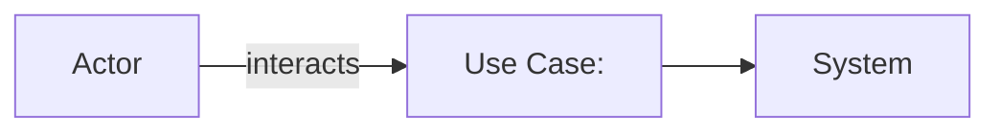
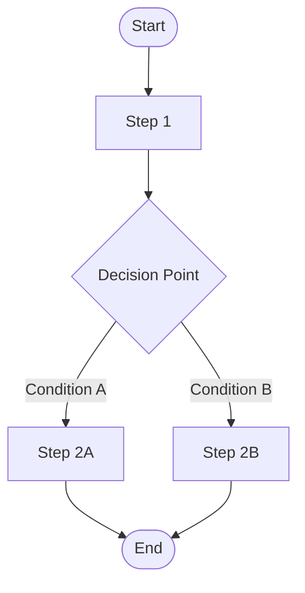
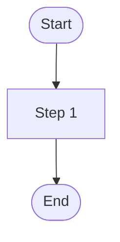
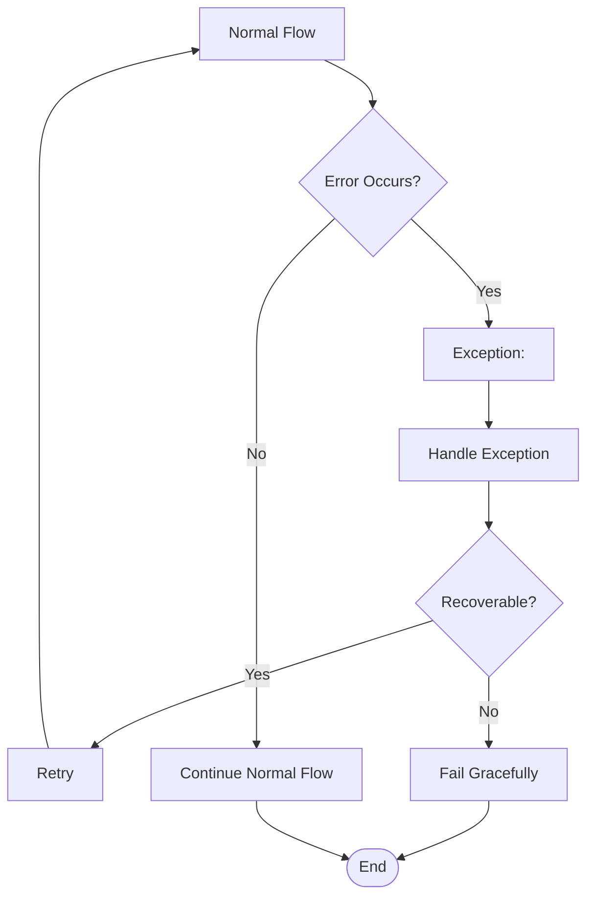
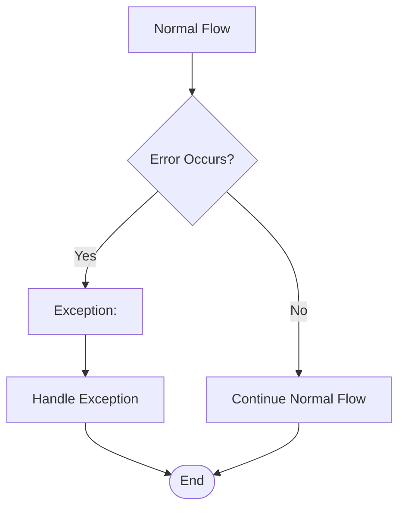

# System Behavior Model

## Metadata

- **UUID:** BH1
- **Workflow Node:** BH1
- **Status:** draft | active | complete
- **Dependencies:** BN1 (Goals & Success Criteria)
- **Next Node:** PM1 (Resource Planning), PM2 (Risk Assessment), DM1 (Data Model), DE1 (Design Model), AR1 (Architecture Model)

---

## Use Case Specifications

<!-- AI_INSTRUCTION: Define use cases with actors, main flows, and alternative flows. Generate UUID for each use case. Include Mermaid use case diagrams. -->

<!-- TYPE: array[object], REQUIRED, MIN_ITEMS: 3, MAX_ITEMS: 20 -->
<!-- SCHEMA: {uuid: string, name: string, actor: string, description: string, main_flow: array[string], alternative_flows: array[object]} -->

### Use Case 1: `BH1-UC-001`
<!-- TYPE: uuid, REQUIRED, FORMAT: {ARTIFACT_UUID}-UC-{SEQUENCE} -->

- **Name:** <!-- TYPE: string, REQUIRED, MAX_LENGTH: 100 -->
- **Actor:** <!-- TYPE: string, REQUIRED, MAX_LENGTH: 50 -->
- **Description:** <!-- TYPE: string, REQUIRED, MAX_LENGTH: 300 -->
- **Main Flow:**
  1. <!-- TYPE: string, REQUIRED, MAX_LENGTH: 200 -->
  2. <!-- TYPE: string, REQUIRED, MAX_LENGTH: 200 -->
  3. <!-- TYPE: string, REQUIRED, MAX_LENGTH: 200 -->
- **Alternative Flows:**
  - **Alt 1:** <!-- TYPE: string, REQUIRED, MAX_LENGTH: 200 -->
  - **Alt 2:** <!-- TYPE: string, OPTIONAL, MAX_LENGTH: 200 -->

**Use Case Diagram:**

<!-- TYPE: mermaid_diagram, REQUIRED, VALIDATION: must be valid Mermaid syntax -->

### Use Case 2: `BH1-UC-002`
<!-- TYPE: uuid, REQUIRED, FORMAT: {ARTIFACT_UUID}-UC-{SEQUENCE} -->

- **Name:** <!-- TYPE: string, REQUIRED, MAX_LENGTH: 100 -->
- **Actor:** <!-- TYPE: string, REQUIRED, MAX_LENGTH: 50 -->
- **Description:** <!-- TYPE: string, REQUIRED, MAX_LENGTH: 300 -->
- **Main Flow:**
  1. <!-- TYPE: string, REQUIRED, MAX_LENGTH: 200 -->
  2. <!-- TYPE: string, REQUIRED, MAX_LENGTH: 200 -->
- **Alternative Flows:**
  - **Alt 1:** <!-- TYPE: string, REQUIRED, MAX_LENGTH: 200 -->

**Use Case Diagram:**

<!-- TYPE: mermaid_diagram, REQUIRED, VALIDATION: must be valid Mermaid syntax -->

---

## Process Flow Diagrams (BPMN)

<!-- AI_INSTRUCTION: Create BPMN-style process flow diagrams using Mermaid flowchart syntax. Include decision points, parallel paths, and swimlanes where applicable. Generate UUID for each process flow. -->

<!-- TYPE: array[object], REQUIRED, MIN_ITEMS: 2, MAX_ITEMS: 10 -->
<!-- SCHEMA: {uuid: string, name: string, description: string, diagram: string (mermaid)} -->

### Process Flow 1: `BH1-PF-001`
<!-- TYPE: uuid, REQUIRED, FORMAT: {ARTIFACT_UUID}-PF-{SEQUENCE} -->

- **Name:** <!-- TYPE: string, REQUIRED, MAX_LENGTH: 100 -->
- **Description:** <!-- TYPE: string, REQUIRED, MAX_LENGTH: 300 -->

**BPMN Flowchart:**

<!-- TYPE: mermaid_diagram, REQUIRED, VALIDATION: must be valid Mermaid syntax -->

### Process Flow 2: `BH1-PF-002`
<!-- TYPE: uuid, REQUIRED, FORMAT: {ARTIFACT_UUID}-PF-{SEQUENCE} -->

- **Name:** <!-- TYPE: string, REQUIRED, MAX_LENGTH: 100 -->
- **Description:** <!-- TYPE: string, REQUIRED, MAX_LENGTH: 300 -->

**BPMN Flowchart:**

<!-- TYPE: mermaid_diagram, REQUIRED, VALIDATION: must be valid Mermaid syntax -->

---

## Decision Tables

<!-- AI_INSTRUCTION: Define decision rules using decision tables. Each table should cover conditions, actions, and rules. Generate UUID for each decision table. -->

<!-- TYPE: array[object], REQUIRED, MIN_ITEMS: 2, MAX_ITEMS: 10 -->
<!-- SCHEMA: {uuid: string, name: string, description: string, conditions: array[string], actions: array[string], rules: array[object]} -->

### Decision Table 1: `BH1-DT-001`
<!-- TYPE: uuid, REQUIRED, FORMAT: {ARTIFACT_UUID}-DT-{SEQUENCE} -->

- **Name:** <!-- TYPE: string, REQUIRED, MAX_LENGTH: 100 -->
- **Description:** <!-- TYPE: string, REQUIRED, MAX_LENGTH: 300 -->

**Conditions:**
- <!-- TYPE: string, REQUIRED, MAX_LENGTH: 100 -->
- <!-- TYPE: string, REQUIRED, MAX_LENGTH: 100 -->

**Actions:**
- <!-- TYPE: string, REQUIRED, MAX_LENGTH: 100 -->
- <!-- TYPE: string, REQUIRED, MAX_LENGTH: 100 -->

| Condition 1 | Condition 2 | Action 1 | Action 2 |
|-------------|-------------|----------|----------|
| <!-- TYPE: enum[Y|N|-], REQUIRED --> | <!-- TYPE: enum[Y|N|-], REQUIRED --> | <!-- TYPE: enum[Y|N|X], REQUIRED --> | <!-- TYPE: enum[Y|N|X], REQUIRED --> |
| <!-- TYPE: enum[Y|N|-], REQUIRED --> | <!-- TYPE: enum[Y|N|-], REQUIRED --> | <!-- TYPE: enum[Y|N|X], REQUIRED --> | <!-- TYPE: enum[Y|N|X], REQUIRED --> |

**Legend:** Y = Yes, N = No, - = Not applicable, X = Action executed

### Decision Table 2: `BH1-DT-002`
<!-- TYPE: uuid, REQUIRED, FORMAT: {ARTIFACT_UUID}-DT-{SEQUENCE} -->

- **Name:** <!-- TYPE: string, REQUIRED, MAX_LENGTH: 100 -->
- **Description:** <!-- TYPE: string, REQUIRED, MAX_LENGTH: 300 -->

**Conditions:**
- <!-- TYPE: string, REQUIRED, MAX_LENGTH: 100 -->

**Actions:**
- <!-- TYPE: string, REQUIRED, MAX_LENGTH: 100 -->

| Condition 1 | Action 1 |
|-------------|----------|
| <!-- TYPE: enum[Y|N|-], REQUIRED --> | <!-- TYPE: enum[Y|N|X], REQUIRED --> |
| <!-- TYPE: enum[Y|N|-], REQUIRED --> | <!-- TYPE: enum[Y|N|X], REQUIRED --> |

---

## Business Rules

<!-- AI_INSTRUCTION: Define business rules that govern system behavior. Generate UUID for each business rule. -->

<!-- TYPE: array[object], REQUIRED, MIN_ITEMS: 2, MAX_ITEMS: 15 -->
<!-- SCHEMA: {uuid: string, rule: string, description: string, applies_to: string} -->

| UUID | Business Rule | Description | Applies To |
|------|---------------|-------------|------------|
| `BH1-BR-001` | <!-- TYPE: string, REQUIRED, MAX_LENGTH: 200 --> | <!-- TYPE: string, REQUIRED, MAX_LENGTH: 300 --> | <!-- TYPE: string, REQUIRED, MAX_LENGTH: 100 --> |
| `BH1-BR-002` | <!-- TYPE: string, REQUIRED, MAX_LENGTH: 200 --> | <!-- TYPE: string, REQUIRED, MAX_LENGTH: 300 --> | <!-- TYPE: string, REQUIRED, MAX_LENGTH: 100 --> |

<!-- TYPE: uuid, REQUIRED, FORMAT: {ARTIFACT_UUID}-BR-{SEQUENCE} -->

---

## Exception Logic & Error Handling

<!-- AI_INSTRUCTION: Map exception scenarios and error handling logic using Mermaid flowcharts. Generate UUID for each exception scenario. -->

<!-- TYPE: array[object], REQUIRED, MIN_ITEMS: 2, MAX_ITEMS: 10 -->
<!-- SCHEMA: {uuid: string, name: string, description: string, trigger: string, handling: string, diagram: string (mermaid)} -->

### Exception Scenario 1: `BH1-EX-001`
<!-- TYPE: uuid, REQUIRED, FORMAT: {ARTIFACT_UUID}-EX-{SEQUENCE} -->

- **Name:** <!-- TYPE: string, REQUIRED, MAX_LENGTH: 100 -->
- **Description:** <!-- TYPE: string, REQUIRED, MAX_LENGTH: 300 -->
- **Trigger:** <!-- TYPE: string, REQUIRED, MAX_LENGTH: 200 -->
- **Handling:** <!-- TYPE: string, REQUIRED, MAX_LENGTH: 300 -->

**Exception Flow Diagram:**

<!-- TYPE: mermaid_diagram, REQUIRED, VALIDATION: must be valid Mermaid syntax -->

### Exception Scenario 2: `BH1-EX-002`
<!-- TYPE: uuid, REQUIRED, FORMAT: {ARTIFACT_UUID}-EX-{SEQUENCE} -->

- **Name:** <!-- TYPE: string, REQUIRED, MAX_LENGTH: 100 -->
- **Description:** <!-- TYPE: string, REQUIRED, MAX_LENGTH: 300 -->
- **Trigger:** <!-- TYPE: string, REQUIRED, MAX_LENGTH: 200 -->
- **Handling:** <!-- TYPE: string, REQUIRED, MAX_LENGTH: 300 -->

**Exception Flow Diagram:**

<!-- TYPE: mermaid_diagram, REQUIRED, VALIDATION: must be valid Mermaid syntax -->

---

## Validation Checklist

<!-- AI_INSTRUCTION: Verify all items are complete before marking status as "complete" -->

- [ ] All use cases documented with actors, main flows, and alternative flows
- [ ] Use case diagrams created in Mermaid format
- [ ] BPMN process flowcharts complete with decision points
- [ ] Decision tables defined with conditions and actions
- [ ] Business rules documented
- [ ] Exception logic mapped with error handling flows
- [ ] All UUIDs generated and unique
- [ ] Dependencies on BN1 are satisfied
- [ ] Status updated to "complete"

---

**Next Steps:** [PM1] Resource Planning, [PM2] Risk Assessment, [DM1] Data Model, [DE1] Design Model, [AR1] Architecture Model
