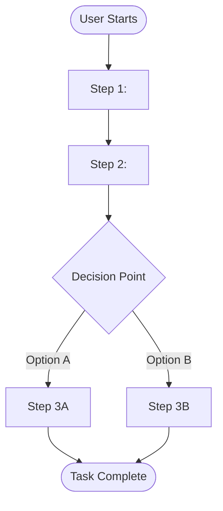
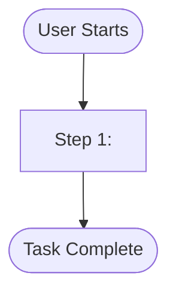

# Design Model

## Metadata

- **UUID:** DE1
- **Workflow Node:** DE1
- **Status:** draft | active | complete
- **Dependencies:** BH1 (System Behavior Model)
- **Next Node:** RD2 (Requirements Model)

---

## User Task Flows

<!-- AI_INSTRUCTION: Define user task flows showing interaction sequences. Use Mermaid flowcharts to visualize user journeys. Generate UUID for each task flow. -->

<!-- TYPE: array[object], REQUIRED, MIN_ITEMS: 3, MAX_ITEMS: 15 -->
<!-- SCHEMA: {uuid: string, task_name: string, user_persona: string, description: string, diagram: string (mermaid)} -->

### Task Flow 1: `DE1-TF-001`
<!-- TYPE: uuid, REQUIRED, FORMAT: {ARTIFACT_UUID}-TF-{SEQUENCE} -->

- **Task Name:** <!-- TYPE: string, REQUIRED, MAX_LENGTH: 100 -->
- **User Persona:** <!-- TYPE: string, REQUIRED, MAX_LENGTH: 50 -->
- **Description:** <!-- TYPE: string, REQUIRED, MAX_LENGTH: 300 -->

**Task Flow Diagram:**



<!-- TYPE: mermaid_diagram, REQUIRED, VALIDATION: must be valid Mermaid syntax -->

### Task Flow 2: `DE1-TF-002`
<!-- TYPE: uuid, REQUIRED, FORMAT: {ARTIFACT_UUID}-TF-{SEQUENCE} -->

- **Task Name:** <!-- TYPE: string, REQUIRED, MAX_LENGTH: 100 -->
- **User Persona:** <!-- TYPE: string, REQUIRED, MAX_LENGTH: 50 -->
- **Description:** <!-- TYPE: string, REQUIRED, MAX_LENGTH: 300 -->

**Task Flow Diagram:**



<!-- TYPE: mermaid_diagram, REQUIRED, VALIDATION: must be valid Mermaid syntax -->

---

## Design System

<!-- AI_INSTRUCTION: Define design system including color palette, typography, spacing, components, and design tokens. Generate UUID for each design element. -->

### Color Palette

<!-- TYPE: array[object], REQUIRED, MIN_ITEMS: 3, MAX_ITEMS: 20 -->
<!-- SCHEMA: {uuid: string, color_name: string, hex_code: string, usage: string, accessibility_notes: string} -->

| UUID | Color Name | Hex Code | Usage | Accessibility Notes |
|------|------------|----------|-------|---------------------|
| `DE1-COL-001` | <!-- TYPE: string, REQUIRED, MAX_LENGTH: 50 --> | <!-- TYPE: string, REQUIRED, FORMAT: #RRGGBB --> | <!-- TYPE: string, REQUIRED, MAX_LENGTH: 200 --> | <!-- TYPE: string, OPTIONAL, MAX_LENGTH: 200 --> |
| `DE1-COL-002` | <!-- TYPE: string, REQUIRED, MAX_LENGTH: 50 --> | <!-- TYPE: string, REQUIRED, FORMAT: #RRGGBB --> | <!-- TYPE: string, REQUIRED, MAX_LENGTH: 200 --> | <!-- TYPE: string, OPTIONAL, MAX_LENGTH: 200 --> |

### Typography

<!-- TYPE: array[object], REQUIRED, MIN_ITEMS: 3, MAX_ITEMS: 15 -->
<!-- SCHEMA: {uuid: string, style_name: string, font_family: string, font_size: string, font_weight: string, line_height: string, usage: string} -->

| UUID | Style Name | Font Family | Font Size | Font Weight | Line Height | Usage |
|------|------------|-------------|-----------|-------------|-------------|-------|
| `DE1-TYP-001` | <!-- TYPE: string, REQUIRED, MAX_LENGTH: 50 --> | <!-- TYPE: string, REQUIRED, MAX_LENGTH: 100 --> | <!-- TYPE: string, REQUIRED, MAX_LENGTH: 20 --> | <!-- TYPE: string, REQUIRED, MAX_LENGTH: 20 --> | <!-- TYPE: string, REQUIRED, MAX_LENGTH: 20 --> | <!-- TYPE: string, REQUIRED, MAX_LENGTH: 200 --> |

### Spacing & Layout

<!-- TYPE: array[object], REQUIRED, MIN_ITEMS: 3, MAX_ITEMS: 15 -->
<!-- SCHEMA: {uuid: string, token_name: string, value: string, unit: string, usage: string} -->

| UUID | Token Name | Value | Unit | Usage |
|------|------------|-------|------|-------|
| `DE1-SPC-001` | <!-- TYPE: string, REQUIRED, MAX_LENGTH: 50 --> | <!-- TYPE: string, REQUIRED, MAX_LENGTH: 20 --> | <!-- TYPE: string, REQUIRED, MAX_LENGTH: 10, EXAMPLE: px|rem|em --> | <!-- TYPE: string, REQUIRED, MAX_LENGTH: 200 --> |

### UI Components

<!-- TYPE: array[object], REQUIRED, MIN_ITEMS: 5, MAX_ITEMS: 30 -->
<!-- SCHEMA: {uuid: string, component_name: string, description: string, props: array[string], states: array[string], accessibility: string} -->

| UUID | Component Name | Description | Props | States | Accessibility |
|------|----------------|-------------|-------|--------|---------------|
| `DE1-COMP-001` | <!-- TYPE: string, REQUIRED, MAX_LENGTH: 50 --> | <!-- TYPE: string, REQUIRED, MAX_LENGTH: 300 --> | <!-- TYPE: array[string], REQUIRED, MIN_ITEMS: 1, MAX_ITEMS: 10 --> | <!-- TYPE: array[string], REQUIRED, MIN_ITEMS: 1, MAX_ITEMS: 10 --> | <!-- TYPE: string, REQUIRED, MAX_LENGTH: 200 --> |

---

## Low-Fidelity Wireframes

<!-- AI_INSTRUCTION: Document low-fidelity wireframes for key screens/pages. Include layout, components, and navigation. Generate UUID for each wireframe. -->

<!-- TYPE: array[object], REQUIRED, MIN_ITEMS: 3, MAX_ITEMS: 20 -->
<!-- SCHEMA: {uuid: string, screen_name: string, description: string, layout: string, key_components: array[string], navigation: string} -->

### Wireframe 1: `DE1-WF-001`
<!-- TYPE: uuid, REQUIRED, FORMAT: {ARTIFACT_UUID}-WF-{SEQUENCE} -->

- **Screen Name:** <!-- TYPE: string, REQUIRED, MAX_LENGTH: 100 -->
- **Description:** <!-- TYPE: string, REQUIRED, MAX_LENGTH: 300 -->
- **Layout:** <!-- TYPE: string, REQUIRED, MAX_LENGTH: 200, EXAMPLE: Single column, Two column, Grid -->
- **Key Components:**
  - <!-- TYPE: string, REQUIRED, MAX_LENGTH: 100 -->
  - <!-- TYPE: string, REQUIRED, MAX_LENGTH: 100 -->
- **Navigation:** <!-- TYPE: string, REQUIRED, MAX_LENGTH: 200 -->

**Wireframe Sketch:**
```
┌─────────────────────────────────────┐
│ Header                              │
├─────────────────────────────────────┤
│                                     │
│  Main Content Area                  │
│                                     │
│                                     │
├─────────────────────────────────────┤
│ Footer                              │
└─────────────────────────────────────┘
```

### Wireframe 2: `DE1-WF-002`
<!-- TYPE: uuid, REQUIRED, FORMAT: {ARTIFACT_UUID}-WF-{SEQUENCE} -->

- **Screen Name:** <!-- TYPE: string, REQUIRED, MAX_LENGTH: 100 -->
- **Description:** <!-- TYPE: string, REQUIRED, MAX_LENGTH: 300 -->
- **Layout:** <!-- TYPE: string, REQUIRED, MAX_LENGTH: 200 -->
- **Key Components:**
  - <!-- TYPE: string, REQUIRED, MAX_LENGTH: 100 -->
- **Navigation:** <!-- TYPE: string, REQUIRED, MAX_LENGTH: 200 -->

---

## Edge Case UI

<!-- AI_INSTRUCTION: Document edge cases and error states in the UI. Include empty states, loading states, error messages, and validation feedback. Generate UUID for each edge case. -->

<!-- TYPE: array[object], REQUIRED, MIN_ITEMS: 3, MAX_ITEMS: 20 -->
<!-- SCHEMA: {uuid: string, edge_case: string, scenario: string, ui_behavior: string, user_message: string, recovery_action: string} -->

### Edge Case 1: `DE1-EC-001`
<!-- TYPE: uuid, REQUIRED, FORMAT: {ARTIFACT_UUID}-EC-{SEQUENCE} -->

- **Edge Case:** <!-- TYPE: string, REQUIRED, MAX_LENGTH: 100, EXAMPLE: Empty state, Loading state, Error state, Validation error -->
- **Scenario:** <!-- TYPE: string, REQUIRED, MAX_LENGTH: 300 -->
- **UI Behavior:** <!-- TYPE: string, REQUIRED, MAX_LENGTH: 300 -->
- **User Message:** <!-- TYPE: string, REQUIRED, MAX_LENGTH: 200 -->
- **Recovery Action:** <!-- TYPE: string, REQUIRED, MAX_LENGTH: 200 -->

### Edge Case 2: `DE1-EC-002`
<!-- TYPE: uuid, REQUIRED, FORMAT: {ARTIFACT_UUID}-EC-{SEQUENCE} -->

- **Edge Case:** <!-- TYPE: string, REQUIRED, MAX_LENGTH: 100 -->
- **Scenario:** <!-- TYPE: string, REQUIRED, MAX_LENGTH: 300 -->
- **UI Behavior:** <!-- TYPE: string, REQUIRED, MAX_LENGTH: 300 -->
- **User Message:** <!-- TYPE: string, REQUIRED, MAX_LENGTH: 200 -->
- **Recovery Action:** <!-- TYPE: string, REQUIRED, MAX_LENGTH: 200 -->

---

## User Interaction Design (HCI Patterns)

<!-- AI_INSTRUCTION: Document human-computer interaction patterns used in the design. Include interaction patterns, feedback mechanisms, and accessibility considerations. Generate UUID for each pattern. -->

<!-- TYPE: array[object], REQUIRED, MIN_ITEMS: 3, MAX_ITEMS: 15 -->
<!-- SCHEMA: {uuid: string, pattern_name: string, description: string, interaction_type: string, feedback: string, accessibility: string} -->

| UUID | Pattern Name | Description | Interaction Type | Feedback | Accessibility |
|------|--------------|-------------|------------------|----------|---------------|
| `DE1-PAT-001` | <!-- TYPE: string, REQUIRED, MAX_LENGTH: 100 --> | <!-- TYPE: string, REQUIRED, MAX_LENGTH: 300 --> | <!-- TYPE: string, REQUIRED, MAX_LENGTH: 100 --> | <!-- TYPE: string, REQUIRED, MAX_LENGTH: 200 --> | <!-- TYPE: string, REQUIRED, MAX_LENGTH: 200 --> |

---

## Validation Checklist

<!-- AI_INSTRUCTION: Verify all items are complete before marking status as "complete" -->

- [ ] User task flows documented with Mermaid diagrams
- [ ] Design system defined (colors, typography, spacing, components)
- [ ] Low-fidelity wireframes created for key screens
- [ ] Edge cases and error states documented
- [ ] HCI patterns documented
- [ ] All UUIDs generated and unique
- [ ] Dependencies on BH1 are satisfied
- [ ] Status updated to "complete"

---

**Next Steps:** [RD2] Requirements Model
