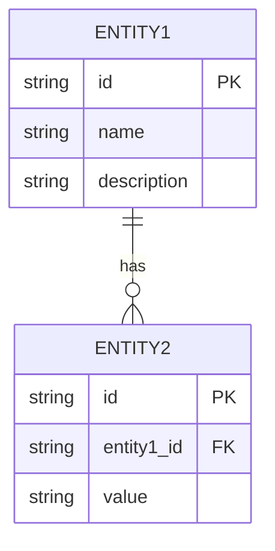

# Data Model

## Metadata

- **UUID:** DM1
- **Workflow Node:** DM1
- **Status:** draft | active | complete
- **Dependencies:** BH1 (System Behavior Model)
- **Next Node:** AR1 (Architecture Model)

---

## Data Dictionary

<!-- AI_INSTRUCTION: Define data dictionary with schema definitions for all entities, attributes, and data types. Generate UUID for each entity and attribute. -->

<!-- TYPE: array[object], REQUIRED, MIN_ITEMS: 3, MAX_ITEMS: 50 -->
<!-- SCHEMA: {uuid: string, entity: string, attribute: string, data_type: string, constraints: string, description: string, example: string} -->

| UUID | Entity | Attribute | Data Type | Constraints | Description | Example |
|------|--------|-----------|-----------|-------------|-------------|---------|
| `DM1-ENT-001` | <!-- TYPE: string, REQUIRED, MAX_LENGTH: 50 --> | <!-- TYPE: string, REQUIRED, MAX_LENGTH: 50 --> | <!-- TYPE: string, REQUIRED, MAX_LENGTH: 50, EXAMPLE: string|number|boolean|date|uuid --> | <!-- TYPE: string, OPTIONAL, MAX_LENGTH: 200, EXAMPLE: NOT NULL, UNIQUE, PRIMARY KEY --> | <!-- TYPE: string, REQUIRED, MAX_LENGTH: 300 --> | <!-- TYPE: string, OPTIONAL, MAX_LENGTH: 100 --> |
| `DM1-ENT-002` | <!-- TYPE: string, REQUIRED, MAX_LENGTH: 50 --> | <!-- TYPE: string, REQUIRED, MAX_LENGTH: 50 --> | <!-- TYPE: string, REQUIRED, MAX_LENGTH: 50 --> | <!-- TYPE: string, OPTIONAL, MAX_LENGTH: 200 --> | <!-- TYPE: string, REQUIRED, MAX_LENGTH: 300 --> | <!-- TYPE: string, OPTIONAL, MAX_LENGTH: 100 --> |

<!-- TYPE: uuid, REQUIRED, FORMAT: {ARTIFACT_UUID}-ENT-{SEQUENCE} -->

---

## Entity-Relationship Diagram (ERD)

<!-- AI_INSTRUCTION: Create entity-relationship diagram using Mermaid ER syntax. Show all entities, relationships, and cardinalities. -->

<!-- TYPE: mermaid_diagram, REQUIRED, VALIDATION: must be valid Mermaid ER syntax -->

### Entity Relationships

<!-- TYPE: array[object], REQUIRED, MIN_ITEMS: 2, MAX_ITEMS: 30 -->
<!-- SCHEMA: {uuid: string, from_entity: string, to_entity: string, relationship_type: enum[One-to-One|One-to-Many|Many-to-Many], cardinality: string, description: string} -->

| UUID | From Entity | To Entity | Relationship Type | Cardinality | Description |
|------|-------------|------------|-------------------|-------------|-------------|
| `DM1-REL-001` | <!-- TYPE: string, REQUIRED, MAX_LENGTH: 50 --> | <!-- TYPE: string, REQUIRED, MAX_LENGTH: 50 --> | <!-- TYPE: enum[One-to-One|One-to-Many|Many-to-Many], REQUIRED --> | <!-- TYPE: string, REQUIRED, MAX_LENGTH: 20, EXAMPLE: 1:1, 1:N, N:M --> | <!-- TYPE: string, REQUIRED, MAX_LENGTH: 300 --> |
| `DM1-REL-002` | <!-- TYPE: string, REQUIRED, MAX_LENGTH: 50 --> | <!-- TYPE: string, REQUIRED, MAX_LENGTH: 50 --> | <!-- TYPE: enum[One-to-One|One-to-Many|Many-to-Many], REQUIRED --> | <!-- TYPE: string, REQUIRED, MAX_LENGTH: 20 --> | <!-- TYPE: string, REQUIRED, MAX_LENGTH: 300 --> |

<!-- TYPE: uuid, REQUIRED, FORMAT: {ARTIFACT_UUID}-REL-{SEQUENCE} -->

---

## Data Constraints & Validation Rules

<!-- AI_INSTRUCTION: Define data constraints and validation rules for all entities and attributes. Generate UUID for each constraint. -->

<!-- TYPE: array[object], REQUIRED, MIN_ITEMS: 3, MAX_ITEMS: 30 -->
<!-- SCHEMA: {uuid: string, entity: string, attribute: string, constraint_type: enum[Required|Unique|Range|Format|Reference|Custom], rule: string, error_message: string} -->

| UUID | Entity | Attribute | Constraint Type | Rule | Error Message |
|------|--------|-----------|-----------------|------|---------------|
| `DM1-CON-001` | <!-- TYPE: string, REQUIRED, MAX_LENGTH: 50 --> | <!-- TYPE: string, REQUIRED, MAX_LENGTH: 50 --> | <!-- TYPE: enum[Required|Unique|Range|Format|Reference|Custom], REQUIRED --> | <!-- TYPE: string, REQUIRED, MAX_LENGTH: 200 --> | <!-- TYPE: string, REQUIRED, MAX_LENGTH: 200 --> |
| `DM1-CON-002` | <!-- TYPE: string, REQUIRED, MAX_LENGTH: 50 --> | <!-- TYPE: string, REQUIRED, MAX_LENGTH: 50 --> | <!-- TYPE: enum[Required|Unique|Range|Format|Reference|Custom], REQUIRED --> | <!-- TYPE: string, REQUIRED, MAX_LENGTH: 200 --> | <!-- TYPE: string, REQUIRED, MAX_LENGTH: 200 --> |

<!-- TYPE: uuid, REQUIRED, FORMAT: {ARTIFACT_UUID}-CON-{SEQUENCE} -->

---

## Non-Functional Requirements (NFR) Specs

<!-- AI_INSTRUCTION: Define non-functional requirements related to data model, including performance, scalability, security, and data quality requirements. Generate UUID for each NFR. -->

### Data Performance Requirements

<!-- TYPE: array[object], REQUIRED, MIN_ITEMS: 2, MAX_ITEMS: 10 -->
<!-- SCHEMA: {uuid: string, requirement: string, metric: string, target_value: string, measurement_method: string} -->

| UUID | Requirement | Metric | Target Value | Measurement Method |
|------|-------------|--------|--------------|-------------------|
| `DM1-NFR-001` | <!-- TYPE: string, REQUIRED, MAX_LENGTH: 200 --> | <!-- TYPE: string, REQUIRED, MAX_LENGTH: 50 --> | <!-- TYPE: string, REQUIRED, MAX_LENGTH: 50 --> | <!-- TYPE: string, REQUIRED, MAX_LENGTH: 200 --> |
| `DM1-NFR-002` | <!-- TYPE: string, REQUIRED, MAX_LENGTH: 200 --> | <!-- TYPE: string, REQUIRED, MAX_LENGTH: 50 --> | <!-- TYPE: string, REQUIRED, MAX_LENGTH: 50 --> | <!-- TYPE: string, REQUIRED, MAX_LENGTH: 200 --> |

### Data Security Requirements

<!-- TYPE: array[object], REQUIRED, MIN_ITEMS: 2, MAX_ITEMS: 10 -->
<!-- SCHEMA: {uuid: string, requirement: string, security_control: string, implementation: string} -->

| UUID | Requirement | Security Control | Implementation |
|------|-------------|------------------|----------------|
| `DM1-SEC-001` | <!-- TYPE: string, REQUIRED, MAX_LENGTH: 200 --> | <!-- TYPE: string, REQUIRED, MAX_LENGTH: 100 --> | <!-- TYPE: string, REQUIRED, MAX_LENGTH: 300 --> |
| `DM1-SEC-002` | <!-- TYPE: string, REQUIRED, MAX_LENGTH: 200 --> | <!-- TYPE: string, REQUIRED, MAX_LENGTH: 100 --> | <!-- TYPE: string, REQUIRED, MAX_LENGTH: 300 --> |

### Data Quality Requirements

<!-- TYPE: array[object], REQUIRED, MIN_ITEMS: 2, MAX_ITEMS: 10 -->
<!-- SCHEMA: {uuid: string, requirement: string, quality_dimension: enum[Accuracy|Completeness|Consistency|Timeliness|Validity], target: string} -->

| UUID | Requirement | Quality Dimension | Target |
|------|-------------|-------------------|--------|
| `DM1-QUAL-001` | <!-- TYPE: string, REQUIRED, MAX_LENGTH: 200 --> | <!-- TYPE: enum[Accuracy|Completeness|Consistency|Timeliness|Validity], REQUIRED --> | <!-- TYPE: string, REQUIRED, MAX_LENGTH: 200 --> |
| `DM1-QUAL-002` | <!-- TYPE: string, REQUIRED, MAX_LENGTH: 200 --> | <!-- TYPE: enum[Accuracy|Completeness|Consistency|Timeliness|Validity], REQUIRED --> | <!-- TYPE: string, REQUIRED, MAX_LENGTH: 200 --> |

<!-- TYPE: uuid, REQUIRED, FORMAT: {ARTIFACT_UUID}-NFR-{SEQUENCE} or {ARTIFACT_UUID}-SEC-{SEQUENCE} or {ARTIFACT_UUID}-QUAL-{SEQUENCE} -->

---

## Validation Checklist

<!-- AI_INSTRUCTION: Verify all items are complete before marking status as "complete" -->

- [ ] Data dictionary includes all entities and attributes
- [ ] ERD diagram is complete and accurate
- [ ] All relationships defined with correct cardinalities
- [ ] Data constraints and validation rules documented
- [ ] NFR specs defined for performance, security, and data quality
- [ ] All UUIDs generated and unique
- [ ] Dependencies on BH1 are satisfied
- [ ] Status updated to "complete"

---

**Next Steps:** [AR1] Architecture Model
