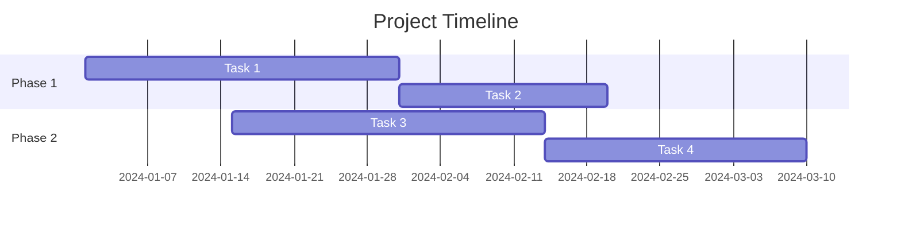

# Resource Planning

## Metadata

- **UUID:** PM1
- **Workflow Node:** PM1
- **Status:** draft | active | complete
- **Dependencies:** BH1 (System Behavior Model)
- **Next Node:** RD2 (Requirements Model)

---

## Resource Allocation Matrix

<!-- AI_INSTRUCTION: Define team composition with role allocation. Generate UUID for each resource allocation. -->

<!-- TYPE: array[object], REQUIRED, MIN_ITEMS: 2, MAX_ITEMS: 20 -->
<!-- SCHEMA: {uuid: string, role: string, team_member: string, allocation_percentage: number, skills: array[string], start_date: string, end_date: string} -->

| UUID | Role | Team Member | Allocation % | Skills | Start Date | End Date |
|------|------|-------------|--------------|--------|------------|----------|
| `PM1-RES-001` | <!-- TYPE: string, REQUIRED, MAX_LENGTH: 50 --> | <!-- TYPE: string, REQUIRED, MAX_LENGTH: 50 --> | <!-- TYPE: number, REQUIRED, MIN: 0, MAX: 100 --> | <!-- TYPE: array[string], REQUIRED, MIN_ITEMS: 1, MAX_ITEMS: 10 --> | <!-- TYPE: string, REQUIRED, FORMAT: YYYY-MM-DD --> | <!-- TYPE: string, REQUIRED, FORMAT: YYYY-MM-DD --> |
| `PM1-RES-002` | <!-- TYPE: string, REQUIRED, MAX_LENGTH: 50 --> | <!-- TYPE: string, REQUIRED, MAX_LENGTH: 50 --> | <!-- TYPE: number, REQUIRED, MIN: 0, MAX: 100 --> | <!-- TYPE: array[string], REQUIRED, MIN_ITEMS: 1, MAX_ITEMS: 10 --> | <!-- TYPE: string, REQUIRED, FORMAT: YYYY-MM-DD --> | <!-- TYPE: string, REQUIRED, FORMAT: YYYY-MM-DD --> |

<!-- TYPE: uuid, REQUIRED, FORMAT: {ARTIFACT_UUID}-RES-{SEQUENCE} -->

---

## Budget Allocation

<!-- AI_INSTRUCTION: Define budget allocation with cost estimation. Generate UUID for each budget item. -->

<!-- TYPE: array[object], REQUIRED, MIN_ITEMS: 3, MAX_ITEMS: 15 -->
<!-- SCHEMA: {uuid: string, category: string, item: string, estimated_cost: number, currency: string, notes: string} -->

| UUID | Category | Item | Estimated Cost | Currency | Notes |
|------|----------|------|----------------|----------|-------|
| `PM1-BUD-001` | <!-- TYPE: string, REQUIRED, MAX_LENGTH: 50 --> | <!-- TYPE: string, REQUIRED, MAX_LENGTH: 100 --> | <!-- TYPE: number, REQUIRED, MIN: 0 --> | <!-- TYPE: string, REQUIRED, MAX_LENGTH: 10, DEFAULT: USD --> | <!-- TYPE: string, OPTIONAL, MAX_LENGTH: 200 --> |
| `PM1-BUD-002` | <!-- TYPE: string, REQUIRED, MAX_LENGTH: 50 --> | <!-- TYPE: string, REQUIRED, MAX_LENGTH: 100 --> | <!-- TYPE: number, REQUIRED, MIN: 0 --> | <!-- TYPE: string, REQUIRED, MAX_LENGTH: 10, DEFAULT: USD --> | <!-- TYPE: string, OPTIONAL, MAX_LENGTH: 200 --> |

**Total Budget:** <!-- TYPE: number, REQUIRED, MIN: 0 --> <!-- TYPE: string, REQUIRED, MAX_LENGTH: 10, DEFAULT: USD -->

<!-- TYPE: uuid, REQUIRED, FORMAT: {ARTIFACT_UUID}-BUD-{SEQUENCE} -->

---

## Timeline & Schedule

<!-- AI_INSTRUCTION: Define project timeline with schedule/Gantt chart. Include milestones and dependencies. Generate UUID for each milestone. -->

### Project Timeline Overview

- **Start Date:** <!-- TYPE: string, REQUIRED, FORMAT: YYYY-MM-DD -->
- **End Date:** <!-- TYPE: string, REQUIRED, FORMAT: YYYY-MM-DD -->
- **Duration:** <!-- TYPE: string, REQUIRED, MAX_LENGTH: 50, EXAMPLE: 12 weeks -->

### Gantt Chart

<!-- TYPE: mermaid_diagram, REQUIRED, VALIDATION: must be valid Mermaid Gantt syntax -->

### Milestones

<!-- TYPE: array[object], REQUIRED, MIN_ITEMS: 3, MAX_ITEMS: 15 -->
<!-- SCHEMA: {uuid: string, name: string, date: string, description: string, dependencies: array[string]} -->

| UUID | Milestone | Date | Description | Dependencies |
|------|-----------|------|-------------|--------------|
| `PM1-MIL-001` | <!-- TYPE: string, REQUIRED, MAX_LENGTH: 100 --> | <!-- TYPE: string, REQUIRED, FORMAT: YYYY-MM-DD --> | <!-- TYPE: string, REQUIRED, MAX_LENGTH: 300 --> | <!-- TYPE: array[string], OPTIONAL, MAX_ITEMS: 5 --> |
| `PM1-MIL-002` | <!-- TYPE: string, REQUIRED, MAX_LENGTH: 100 --> | <!-- TYPE: string, REQUIRED, FORMAT: YYYY-MM-DD --> | <!-- TYPE: string, REQUIRED, MAX_LENGTH: 300 --> | <!-- TYPE: array[string], OPTIONAL, MAX_ITEMS: 5 --> |

<!-- TYPE: uuid, REQUIRED, FORMAT: {ARTIFACT_UUID}-MIL-{SEQUENCE} -->

### Sprint/Iteration Plan

<!-- TYPE: array[object], OPTIONAL, MIN_ITEMS: 0, MAX_ITEMS: 20 -->
<!-- SCHEMA: {uuid: string, sprint_number: number, start_date: string, end_date: string, goals: array[string], deliverables: array[string]} -->

| UUID | Sprint # | Start Date | End Date | Goals | Deliverables |
|------|----------|------------|----------|-------|--------------|
| `PM1-SPR-001` | <!-- TYPE: number, REQUIRED, MIN: 1 --> | <!-- TYPE: string, REQUIRED, FORMAT: YYYY-MM-DD --> | <!-- TYPE: string, REQUIRED, FORMAT: YYYY-MM-DD --> | <!-- TYPE: array[string], REQUIRED, MIN_ITEMS: 1, MAX_ITEMS: 5 --> | <!-- TYPE: array[string], REQUIRED, MIN_ITEMS: 1, MAX_ITEMS: 5 --> |

<!-- TYPE: uuid, REQUIRED, FORMAT: {ARTIFACT_UUID}-SPR-{SEQUENCE} -->

---

## Validation Checklist

<!-- AI_INSTRUCTION: Verify all items are complete before marking status as "complete" -->

- [ ] Resource allocation matrix includes all team members and roles
- [ ] Budget allocation covers all cost categories
- [ ] Timeline includes all phases and milestones
- [ ] Gantt chart is accurate and reflects dependencies
- [ ] All UUIDs generated and unique
- [ ] Dependencies on BH1 are satisfied
- [ ] Status updated to "complete"

---

**Next Steps:** [RD2] Requirements Model
