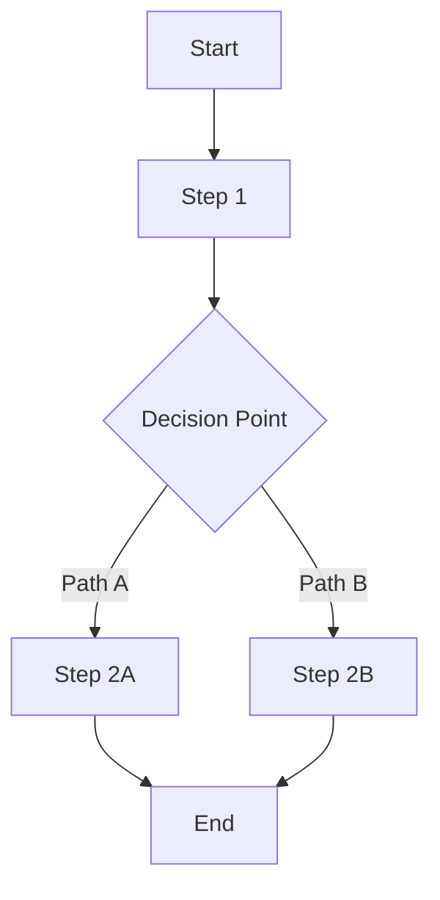

# Problem Definition

## Metadata

- **UUID:** PO1
- **Workflow Node:** PO1
- **Status:** draft | active | complete
- **Dependencies:** START (Project Initiation)
- **Next Node:** ST1 (Stakeholder Analysis)

---

## Part 1: Root Cause Analysis (RCA)

<!-- AI_INSTRUCTION: Provide a clear, concise problem statement. Focus on the "what" and "why", not solutions. Generate UUID for the problem. -->

### Problem Statement

**Problem UUID:** `PO1-PROB-001`
<!-- TYPE: uuid, REQUIRED, FORMAT: {ARTIFACT_UUID}-{TYPE}-{SEQUENCE}, EXAMPLE: PO1-PROB-001 -->
<!-- AI_INSTRUCTION: Generate UUID using format: {artifact_uuid}-PROB-{3-digit-sequence} -->

**What is the problem?**
<!-- TYPE: string, REQUIRED, MAX_LENGTH: 200 -->
<!-- EXAMPLE: Users experience significant cognitive burden when editing Markdown files due to visual clutter from syntax markers. -->

**Why is this a problem?**
<!-- TYPE: string, REQUIRED, MAX_LENGTH: 300 -->
<!-- EXAMPLE: Users spend 20-30% of mental effort parsing syntax instead of focusing on content, leading to reduced productivity and user satisfaction. -->

### Root Cause

<!-- AI_INSTRUCTION: Identify the PRIMARY root cause (not symptoms). Use RCA methodology: ask "why" 5 times. Generate UUIDs for root cause and contributing factors. -->

**Primary Root Cause UUID:** `PO1-RCA-001`
<!-- TYPE: uuid, REQUIRED, FORMAT: {ARTIFACT_UUID}-RCA-{SEQUENCE} -->

**Primary Root Cause:**
<!-- TYPE: string, REQUIRED, MAX_LENGTH: 200 -->
<!-- EXAMPLE: Cognitive load mismatch between user's mental model (formatted content) and Markdown's syntax-based design. -->

**Contributing Factors:**
<!-- TYPE: array[object], OPTIONAL, MIN_ITEMS: 0, MAX_ITEMS: 5 -->
<!-- SCHEMA: {uuid: string, description: string} -->
- **UUID:** `PO1-CF-001` | <!-- TYPE: uuid, REQUIRED, FORMAT: {ARTIFACT_UUID}-CF-{SEQUENCE} --> <!-- TYPE: string, MAX_LENGTH: 150 -->
- **UUID:** `PO1-CF-002` | <!-- TYPE: uuid, REQUIRED, FORMAT: {ARTIFACT_UUID}-CF-{SEQUENCE} --> <!-- TYPE: string, MAX_LENGTH: 150 -->

### Evidence

<!-- AI_INSTRUCTION: List observable evidence supporting the root cause. Include data, user feedback, or metrics. Generate UUID for each evidence item. -->

<!-- TYPE: array[object], REQUIRED, MIN_ITEMS: 2, MAX_ITEMS: 10 -->
<!-- SCHEMA: {uuid: string, description: string, source: string} -->
- **UUID:** `PO1-EVD-001` | <!-- TYPE: uuid, REQUIRED, FORMAT: {ARTIFACT_UUID}-EVD-{SEQUENCE} --> <!-- TYPE: string, MAX_LENGTH: 200 --> | Source: <!-- TYPE: string, OPTIONAL, MAX_LENGTH: 100 -->
- **UUID:** `PO1-EVD-002` | <!-- TYPE: uuid, REQUIRED, FORMAT: {ARTIFACT_UUID}-EVD-{SEQUENCE} --> <!-- TYPE: string, MAX_LENGTH: 200 --> | Source: <!-- TYPE: string, OPTIONAL, MAX_LENGTH: 100 -->

### Solution Direction

<!-- AI_INSTRUCTION: High-level approach to address the root cause. Do not provide detailed implementation. Generate UUID for solution direction. -->

**Solution Direction UUID:** `PO1-SOL-001`
<!-- TYPE: uuid, REQUIRED, FORMAT: {ARTIFACT_UUID}-SOL-{SEQUENCE} -->

<!-- TYPE: string, REQUIRED, MAX_LENGTH: 300 -->
<!-- EXAMPLE: Implement inline formatting visualization that hides syntax markers while maintaining standard Markdown file compatibility. -->

---

## Part 2: Current State Analysis (As-Is Process Map)

<!-- AI_INSTRUCTION: Map the existing process as-is. Use Mermaid flowchart syntax. Include decision points and parallel paths. -->

### Current Process Flow

<!-- TYPE: mermaid_diagram, REQUIRED, VALIDATION: must be valid Mermaid syntax -->

### Pain Points

<!-- AI_INSTRUCTION: List specific pain points in the current process. Include impact and frequency. Generate UUID for each pain point. -->

<!-- TYPE: array[object], REQUIRED, MIN_ITEMS: 1, MAX_ITEMS: 10 -->
<!-- SCHEMA: {uuid: string, name: string, impact: string, frequency: enum[Often|Sometimes|Rarely]} -->

1. **UUID:** `PO1-PP-001` | **<!-- TYPE: string, REQUIRED, MAX_LENGTH: 100 -->**
   <!-- TYPE: uuid, REQUIRED, FORMAT: {ARTIFACT_UUID}-PP-{SEQUENCE} -->
   - Impact: <!-- TYPE: string, REQUIRED, MAX_LENGTH: 200 -->
   - Frequency: <!-- TYPE: enum[Often|Sometimes|Rarely], REQUIRED -->

2. **UUID:** `PO1-PP-002` | **<!-- TYPE: string, REQUIRED, MAX_LENGTH: 100 -->**
   <!-- TYPE: uuid, REQUIRED, FORMAT: {ARTIFACT_UUID}-PP-{SEQUENCE} -->
   - Impact: <!-- TYPE: string, REQUIRED, MAX_LENGTH: 200 -->
   - Frequency: <!-- TYPE: enum[Often|Sometimes|Rarely], REQUIRED -->

### Metrics (Baseline)

<!-- AI_INSTRUCTION: Quantify current state with measurable metrics. These will be used to measure improvement. Generate UUID for each metric. -->

<!-- TYPE: array[object], REQUIRED, MIN_ITEMS: 2, MAX_ITEMS: 10 -->
<!-- SCHEMA: {uuid: string, name: string, value: number|string, unit: string} -->

- **UUID:** `PO1-MET-001` | **<!-- TYPE: string, REQUIRED, MAX_LENGTH: 50 -->:** <!-- TYPE: number|string, REQUIRED --> <!-- TYPE: string, OPTIONAL, MAX_LENGTH: 20 -->
  <!-- TYPE: uuid, REQUIRED, FORMAT: {ARTIFACT_UUID}-MET-{SEQUENCE} -->
- **UUID:** `PO1-MET-002` | **<!-- TYPE: string, REQUIRED, MAX_LENGTH: 50 -->:** <!-- TYPE: number|string, REQUIRED --> <!-- TYPE: string, OPTIONAL, MAX_LENGTH: 20 -->
  <!-- TYPE: uuid, REQUIRED, FORMAT: {ARTIFACT_UUID}-MET-{SEQUENCE} -->

### Constraints

<!-- AI_INSTRUCTION: List technical, business, or regulatory constraints that must be considered. Generate UUID for each constraint. -->

<!-- TYPE: array[object], OPTIONAL, MIN_ITEMS: 0, MAX_ITEMS: 10 -->
<!-- SCHEMA: {uuid: string, description: string, type: enum[Technical|Business|Regulatory]} -->
- **UUID:** `PO1-CON-001` | <!-- TYPE: uuid, REQUIRED, FORMAT: {ARTIFACT_UUID}-CON-{SEQUENCE} --> <!-- TYPE: string, MAX_LENGTH: 200 --> | Type: <!-- TYPE: enum[Technical|Business|Regulatory], REQUIRED -->
- **UUID:** `PO1-CON-002` | <!-- TYPE: uuid, REQUIRED, FORMAT: {ARTIFACT_UUID}-CON-{SEQUENCE} --> <!-- TYPE: string, MAX_LENGTH: 200 --> | Type: <!-- TYPE: enum[Technical|Business|Regulatory], REQUIRED -->

---

## Problem Boundaries (Scope Definition)

<!-- AI_INSTRUCTION: Define the boundaries and scope of the problem. What is in scope and what is out of scope. Generate UUID for scope boundaries. -->

### In Scope

<!-- TYPE: array[object], REQUIRED, MIN_ITEMS: 3, MAX_ITEMS: 15 -->
<!-- SCHEMA: {uuid: string, item: string, rationale: string} -->

| UUID | Item | Rationale |
|------|------|-----------|
| `PO1-SCOPE-001` | <!-- TYPE: string, REQUIRED, MAX_LENGTH: 200 --> | <!-- TYPE: string, REQUIRED, MAX_LENGTH: 300 --> |
| `PO1-SCOPE-002` | <!-- TYPE: string, REQUIRED, MAX_LENGTH: 200 --> | <!-- TYPE: string, REQUIRED, MAX_LENGTH: 300 --> |

### Out of Scope

<!-- TYPE: array[object], REQUIRED, MIN_ITEMS: 1, MAX_ITEMS: 10 -->
<!-- SCHEMA: {uuid: string, item: string, rationale: string} -->

| UUID | Item | Rationale |
|------|------|-----------|
| `PO1-OOS-001` | <!-- TYPE: string, REQUIRED, MAX_LENGTH: 200 --> | <!-- TYPE: string, REQUIRED, MAX_LENGTH: 300 --> |
| `PO1-OOS-002` | <!-- TYPE: string, REQUIRED, MAX_LENGTH: 200 --> | <!-- TYPE: string, REQUIRED, MAX_LENGTH: 300 --> |

---

## Validation Checklist

<!-- AI_INSTRUCTION: Verify all items are complete before marking status as "complete" -->

- [ ] Problem statement is clear and specific
- [ ] Root cause is identified (not just symptoms)
- [ ] Evidence supports root cause
- [ ] Solution direction addresses root cause
- [ ] Current process flow diagram is complete and accurate
- [ ] All pain points identified with impact/frequency
- [ ] Baseline metrics are measurable and documented
- [ ] Constraints are identified
- [ ] Problem boundaries (scope) are defined
- [ ] All UUIDs generated and unique
- [ ] Status updated to "complete"

---

**Next Steps:** [ST1] Stakeholder Analysis
