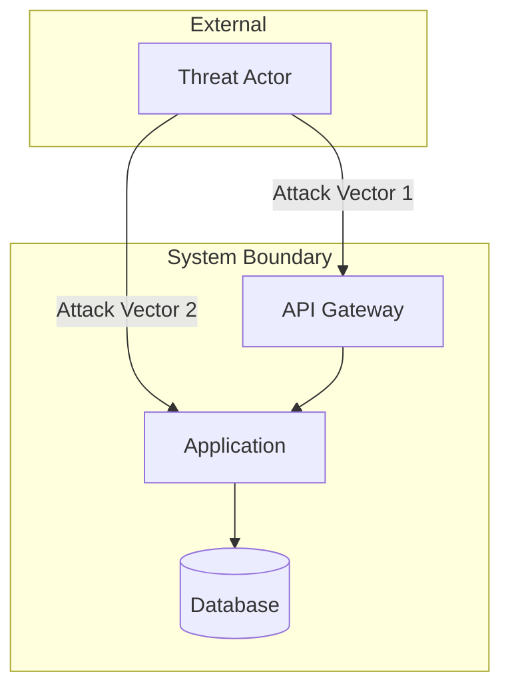

# Security Model

## Metadata

- **UUID:** SC1
- **Workflow Node:** SC1
- **Status:** draft | active | complete
- **Dependencies:** BH1 (System Behavior Model), AR1 (Architecture Model)
- **Next Node:** RD2 (Requirements Model)

---

## Security Requirements

<!-- AI_INSTRUCTION: Define security requirements including authentication, authorization, data protection, and compliance requirements. Generate UUID for each security requirement. -->

### Authentication Requirements

<!-- TYPE: array[object], REQUIRED, MIN_ITEMS: 2, MAX_ITEMS: 10 -->
<!-- SCHEMA: {uuid: string, requirement: string, description: string, priority: enum[High|Medium|Low], compliance: string} -->

| UUID | Requirement | Description | Priority | Compliance |
|------|-------------|-------------|----------|------------|
| `SC1-AUTH-001` | <!-- TYPE: string, REQUIRED, MAX_LENGTH: 200 --> | <!-- TYPE: string, REQUIRED, MAX_LENGTH: 300 --> | <!-- TYPE: enum[High|Medium|Low], REQUIRED --> | <!-- TYPE: string, OPTIONAL, MAX_LENGTH: 100 --> |
| `SC1-AUTH-002` | <!-- TYPE: string, REQUIRED, MAX_LENGTH: 200 --> | <!-- TYPE: string, REQUIRED, MAX_LENGTH: 300 --> | <!-- TYPE: enum[High|Medium|Low], REQUIRED --> | <!-- TYPE: string, OPTIONAL, MAX_LENGTH: 100 --> |

### Authorization Requirements

<!-- TYPE: array[object], REQUIRED, MIN_ITEMS: 2, MAX_ITEMS: 10 -->
<!-- SCHEMA: {uuid: string, requirement: string, description: string, priority: enum[High|Medium|Low], rbac_mapping: string} -->

| UUID | Requirement | Description | Priority | RBAC Mapping |
|------|-------------|-------------|----------|--------------|
| `SC1-AUTHZ-001` | <!-- TYPE: string, REQUIRED, MAX_LENGTH: 200 --> | <!-- TYPE: string, REQUIRED, MAX_LENGTH: 300 --> | <!-- TYPE: enum[High|Medium|Low], REQUIRED --> | <!-- TYPE: string, REQUIRED, MAX_LENGTH: 100 --> |

### Data Protection Requirements

<!-- TYPE: array[object], REQUIRED, MIN_ITEMS: 2, MAX_ITEMS: 10 -->
<!-- SCHEMA: {uuid: string, requirement: string, description: string, data_type: string, protection_method: string, compliance: string} -->

| UUID | Requirement | Description | Data Type | Protection Method | Compliance |
|------|-------------|-------------|-----------|-------------------|------------|
| `SC1-DATA-001` | <!-- TYPE: string, REQUIRED, MAX_LENGTH: 200 --> | <!-- TYPE: string, REQUIRED, MAX_LENGTH: 300 --> | <!-- TYPE: string, REQUIRED, MAX_LENGTH: 100 --> | <!-- TYPE: string, REQUIRED, MAX_LENGTH: 200 --> | <!-- TYPE: string, OPTIONAL, MAX_LENGTH: 100 --> |

### Compliance Requirements

<!-- TYPE: array[object], REQUIRED, MIN_ITEMS: 1, MAX_ITEMS: 10 -->
<!-- SCHEMA: {uuid: string, compliance_standard: string, requirement: string, description: string, implementation: string} -->

| UUID | Compliance Standard | Requirement | Description | Implementation |
|------|---------------------|-------------|-------------|-----------------|
| `SC1-COMP-001` | <!-- TYPE: string, REQUIRED, MAX_LENGTH: 100, EXAMPLE: GDPR|HIPAA|PCI-DSS|SOC2 --> | <!-- TYPE: string, REQUIRED, MAX_LENGTH: 200 --> | <!-- TYPE: string, REQUIRED, MAX_LENGTH: 300 --> | <!-- TYPE: string, REQUIRED, MAX_LENGTH: 500 --> |

---

## Threat Model

<!-- AI_INSTRUCTION: Create threat model diagram showing attack surface, threat actors, and attack vectors. Generate UUID for each threat. -->

### Threat Model Diagram

<!-- TYPE: mermaid_diagram, REQUIRED, VALIDATION: must be valid Mermaid syntax -->

### Threat Identification

<!-- TYPE: array[object], REQUIRED, MIN_ITEMS: 3, MAX_ITEMS: 20 -->
<!-- SCHEMA: {uuid: string, threat: string, threat_actor: string, attack_vector: string, impact: enum[High|Medium|Low], probability: enum[High|Medium|Low], risk_score: string} -->

| UUID | Threat | Threat Actor | Attack Vector | Impact | Probability | Risk Score |
|------|--------|--------------|---------------|--------|-------------|------------|
| `SC1-THR-001` | <!-- TYPE: string, REQUIRED, MAX_LENGTH: 200 --> | <!-- TYPE: string, REQUIRED, MAX_LENGTH: 100 --> | <!-- TYPE: string, REQUIRED, MAX_LENGTH: 300 --> | <!-- TYPE: enum[High|Medium|Low], REQUIRED --> | <!-- TYPE: enum[High|Medium|Low], REQUIRED --> | <!-- TYPE: string, REQUIRED, MAX_LENGTH: 20 --> |
| `SC1-THR-002` | <!-- TYPE: string, REQUIRED, MAX_LENGTH: 200 --> | <!-- TYPE: string, REQUIRED, MAX_LENGTH: 100 --> | <!-- TYPE: string, REQUIRED, MAX_LENGTH: 300 --> | <!-- TYPE: enum[High|Medium|Low], REQUIRED --> | <!-- TYPE: enum[High|Medium|Low], REQUIRED --> | <!-- TYPE: string, REQUIRED, MAX_LENGTH: 20 --> |

**Risk Score Calculation:** Impact × Probability (High=3, Medium=2, Low=1)

---

## Security Controls Matrix

<!-- AI_INSTRUCTION: Define security controls to mitigate identified threats. Generate UUID for each security control. -->

<!-- TYPE: array[object], REQUIRED, MIN_ITEMS: 5, MAX_ITEMS: 30 -->
<!-- SCHEMA: {uuid: string, control_name: string, control_type: enum[Preventive|Detective|Corrective|Compensating], threat_uuid: string (references SC1-THR-XXX), implementation: string, effectiveness: enum[High|Medium|Low]} -->

| UUID | Control Name | Control Type | Threat UUID | Implementation | Effectiveness |
|------|--------------|--------------|--------------|----------------|---------------|
| `SC1-CTRL-001` | <!-- TYPE: string, REQUIRED, MAX_LENGTH: 100 --> | <!-- TYPE: enum[Preventive|Detective|Corrective|Compensating], REQUIRED --> | <!-- TYPE: string, REQUIRED, FORMAT: SC1-THR-XXX --> | <!-- TYPE: string, REQUIRED, MAX_LENGTH: 500 --> | <!-- TYPE: enum[High|Medium|Low], REQUIRED --> |
| `SC1-CTRL-002` | <!-- TYPE: string, REQUIRED, MAX_LENGTH: 100 --> | <!-- TYPE: enum[Preventive|Detective|Corrective|Compensating], REQUIRED --> | <!-- TYPE: string, REQUIRED, FORMAT: SC1-THR-XXX --> | <!-- TYPE: string, REQUIRED, MAX_LENGTH: 500 --> | <!-- TYPE: enum[High|Medium|Low], REQUIRED --> |

**Control Type Definitions:**
- **Preventive:** Prevents security incidents from occurring
- **Detective:** Detects security incidents when they occur
- **Corrective:** Corrects or mitigates the impact of security incidents
- **Compensating:** Alternative controls when primary controls are not feasible

---

## Security Architecture Document

<!-- AI_INSTRUCTION: Document security architecture including security layers, defense in depth, and security controls implementation. Generate UUID for each architectural component. -->

### Security Architecture Overview

<!-- TYPE: string, REQUIRED, MAX_LENGTH: 1000 -->

### Defense in Depth Layers

<!-- TYPE: array[object], REQUIRED, MIN_ITEMS: 3, MAX_ITEMS: 10 -->
<!-- SCHEMA: {uuid: string, layer_name: string, description: string, controls: array[string], responsibilities: string} -->

| UUID | Layer Name | Description | Controls | Responsibilities |
|------|------------|-------------|----------|-----------------|
| `SC1-LAYER-001` | <!-- TYPE: string, REQUIRED, MAX_LENGTH: 100, EXAMPLE: Network|Application|Data|Identity --> | <!-- TYPE: string, REQUIRED, MAX_LENGTH: 300 --> | <!-- TYPE: array[string], REQUIRED, MIN_ITEMS: 1, MAX_ITEMS: 10 --> | <!-- TYPE: string, REQUIRED, MAX_LENGTH: 300 --> |

### Security Control Implementation

<!-- TYPE: array[object], REQUIRED, MIN_ITEMS: 5, MAX_ITEMS: 20 -->
<!-- SCHEMA: {uuid: string, control_uuid: string (references SC1-CTRL-XXX), component: string, implementation_details: string, configuration: string, monitoring: string} -->

| UUID | Control UUID | Component | Implementation Details | Configuration | Monitoring |
|------|--------------|-----------|------------------------|----------------|------------|
| `SC1-IMPL-001` | <!-- TYPE: string, REQUIRED, FORMAT: SC1-CTRL-XXX --> | <!-- TYPE: string, REQUIRED, MAX_LENGTH: 100 --> | <!-- TYPE: string, REQUIRED, MAX_LENGTH: 500 --> | <!-- TYPE: string, REQUIRED, MAX_LENGTH: 300 --> | <!-- TYPE: string, REQUIRED, MAX_LENGTH: 300 --> |

### Security Monitoring & Incident Response

- **Security Monitoring:** <!-- TYPE: string, REQUIRED, MAX_LENGTH: 500 -->
- **Incident Response Plan:** <!-- TYPE: string, REQUIRED, MAX_LENGTH: 500 -->
- **Logging & Auditing:** <!-- TYPE: string, REQUIRED, MAX_LENGTH: 500 -->
- **Security Testing:** <!-- TYPE: string, REQUIRED, MAX_LENGTH: 500 -->

---

## Validation Checklist

<!-- AI_INSTRUCTION: Verify all items are complete before marking status as "complete" -->

- [ ] Security requirements defined (authentication, authorization, data protection, compliance)
- [ ] Threat model complete with identified threats and attack vectors
- [ ] Security controls matrix includes controls for all high-risk threats
- [ ] Security architecture documented with defense in depth layers
- [ ] Security controls implementation details specified
- [ ] Monitoring and incident response plan defined
- [ ] All UUIDs generated and unique
- [ ] Dependencies on BH1 and AR1 are satisfied
- [ ] Status updated to "complete"

---

**Next Steps:** [RD2] Requirements Model
